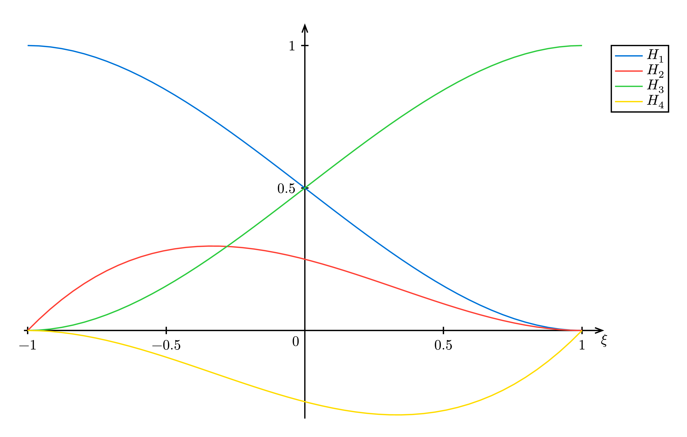
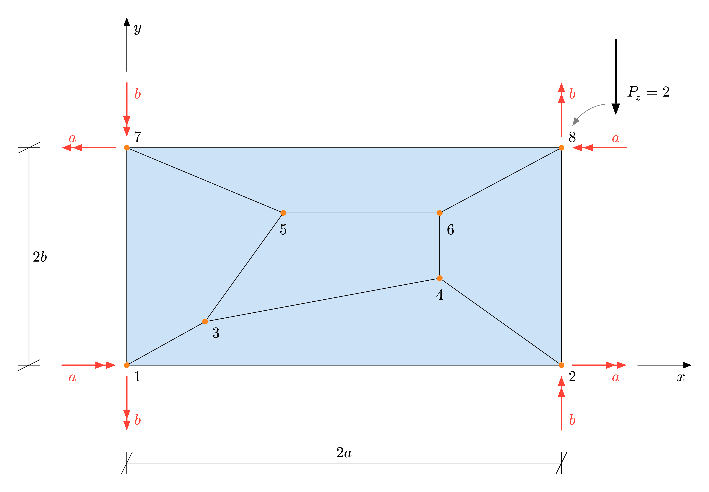
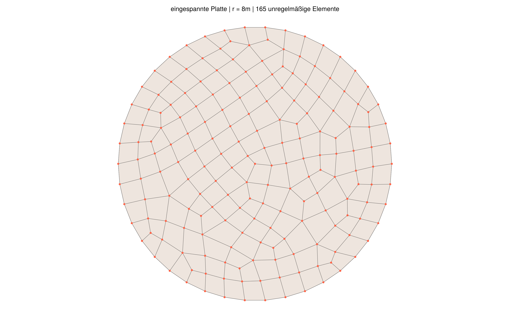
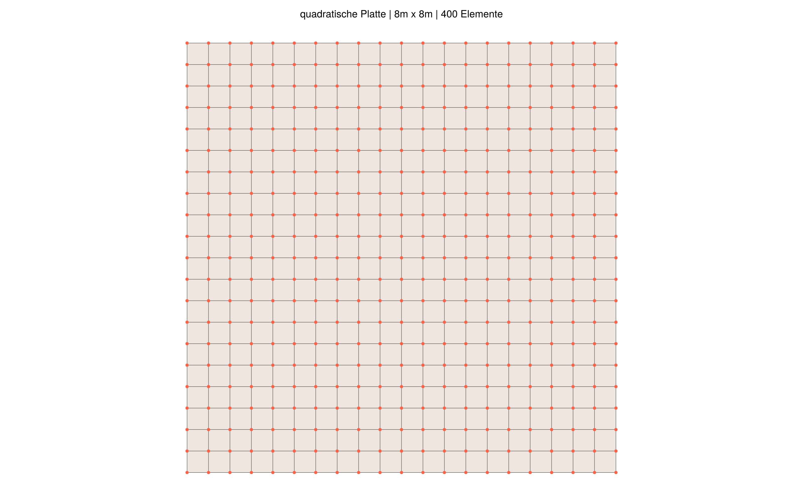
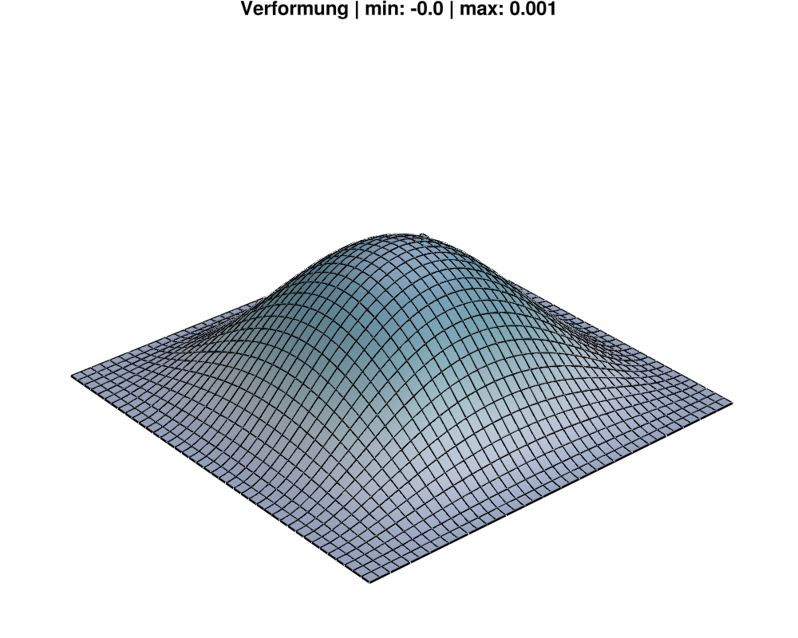

<!-- Kapitel 1 -->

# Einleitung

## Motivation {#sec-motivation}

Wird die Finite Elemente Methode (FEM), ohne ausreichende Kenntnisse über die Berechnungsmethode, als "Black-Box"- Methode, angewandt, sind häufig Fehler die Konsequenz (s. Vortrag auf der 4. FEM-Tagung der TU Darmstadt im Jahr 1996). R.D. Cook, D.S. Malkus und M.E. Plesha warnen bereits in dem Jahr 1988 davor, dass den Ergebnissen der FE-Berechnung nur dann getraut werden kann, wenn der Anwender über konkretes Wissen, bezüglich des internen Berechnungsablaufs des Programms, verfügt und Kenntnis über die physikalischen Grundlagen hat.

_"Their results cannot be trusted if users have no knowledge of their internal workings and little understanding of the physical theories on which they are based."_ - Cook et al.

Die Finite-Elemente-Methode (FEM) hat sich als eine der leistungsfähigsten und vielseitigsten Techniken zur Analyse komplexer ingenieurtechnischer Probleme etabliert. Trotz der weit verbreiteten Anwendung der FEM in der Ingenieurpraxis ist die Literatur zu den spezifischen Verfahren und Methoden zur Anwendung der Kirchhoff-Plattentheorie oft unzureichend. Ein Mangel an klaren und umfassenden Erklärungen zu den notwendigen mathematischen und mechanischen Grundlagen kann die Entwicklung effizienter und präziser FEM-Modelle behindern. Aber auch der Anwender sollte ausreichende Kentnisse haben, über die komplexen Berechnungsvorgänge im Hintergrund eines FEM-Programms und den Ergebnissen nicht blind vertrauen. 

{#fig-sleipner-A fig-env="figure*" width=45%}

Der Schadenfall an der Bohrplattform Sleipner A (@fig-sleipner-A) zeigt, dass auch Fehler mit schwerwiegenden Folgen gemacht werden können. Direkt nach dem Unfall ernannte der Besitzer der Plattform, die Firma Statoil, eine Ermittlungsgruppe. Es zeigte sich, dass bei der fehlerhaften Umsetzung der Finite Elemente Berechnung in einen Bewehrungsplan die Ursache für den Untergang lag.^[https://www-users.cse.umn.edu/~arnold/disasters/sleipner.html]

Für das Verständnis der FE-Methode ist es essentiell die Grundideen zu verinnerlichen. Die wesentlichen zwei Aspekte der Methode sind die Approximation einer Lösung durch Kombination von vordefinierten Funktionen und die stückweise Definition der Funktionen auf sogenannten Elementen. Die Kirchhoff-Plattentheorie stellt dabei, neben der Reissner-Mindlin Theorie, eine fundamentale Grundlage dar, um das Verhalten von dünnen Platten zu analysieren. Die vorliegende Masterarbeit zielt darauf ab, die theoretischen Grundlagen zur Formulierung von FEM-Methoden für Kirchhoff-Platten systematisch aufzubereitet und in der Programmiersprache JULIA zu implementieren. 

Nicht zuletzt wird durch die Implementierung in JULIA ein modernes und leistungsfähiges Werkzeug genutzt, sondern auch die Möglichkeit geschaffen, die Ergebnisse offen zugänglich zu machen und zur Weiterentwicklung der FEM-Methoden beizutragen.


## Problemstellung {#sec-problemstellung}

Die Analyse von Plattentragwerken ist eine zentrale Aufgabe im Bauingenieurwesen, da sie in einer Vielzahl von Konstruktionen eine wesentliche Rolle spielen. Die Ingenieursliteratur zur Implementierung der FEM für Kirchhoff-Platten beschränkt sich oft auf rechteckige Elemente und ist auch hier teilweise lückenhaft. Für die Berechnung komplexer Strukturen ist die Formulierung für allgemeine Vierecke jedoch von wesentlicher Bedeutung.

Die Verträglichkeit der Rotation von benachbarten Elemente stellt bei der Finite Elemente Analyse eine besondere Herausforderung dar. Ist die Verträglichkeit bei benachbarten Rechteckelementen am gemeinsamen Knoten gegeben, sodass bei der Darstellung der Rotationen keine Knicke vorhanden sind, so wird bei dem Elementansatz von einer sogenannten $C^1$-Kontinuität gesprochen. Diese Kontinuität erfüllt der kubische Ansatz des Bogner-Fox-Schmitt Elements. Für die Berechnung allgemeiner Vierecke ist dieser Ansatz jedoch unbrauchbar, da der zusätzliche Freiheitsgrad $\theta_{\xi\eta}$ störend wirkt. 

Ziel dieser Arbeit ist die Herleitung einer ausgewählten Formulierung für allgemeine Vierecke, sowie die Implementierung in der Programmierumgebung JULIA. An ausgewählten Anwendungsbeispielen wird die Umsetzung verifiziert und dadurch eine offene und nachvollziehbare Lösung für die Anwendung der Kirchhoff-Plattentheorie geschaffen.

Zudem ist das grundlegende Verständnis der Finite Element Methode und etablierter Elementansätze von großer Wichtigkeit. Die Erläuterung numerischer Methoden für die Kirchhoffsche Plattentheorie ist, vor allem in der deutschsprachigen Literatur, bisher sehr lückenhaft. Daher stellt die Aufarbeitung theoretischer Grundlagen, die zur Formulierung der FEM für Kirchhoffplatten notwending sind, ein weiteres Ziel dar. Dies beinhaltet sowohl mechanischen Zusammenhänge, als auch mathematische Verfahren.


## Gliederung der Arbeit {#sec-gliederung}

Die Grundlagen der Finite Elemente Methode sind in @sec-Grundlagen-FEM dargestellt. Dabei wird zunächst in @sec-einfuehrungsbeispiel anhand eines Einführungsbeispiels der Ablauf der FEM beschrieben. Anschließend werden die diverse Elementansätze für finite Elemente erläutert und deren Kontinuität dargestellt. Weiterhin werden die zwei wesentlichen Schritte der Finite Elemente Analyse _Approximation_ und _numerische Lösung_ in @sec-approximation-funktionen und @sec-numerische-loesung erläutert.

Die zur Analyse notwendigen Differentialgleichungen einer Kirchhoff Platte werden in @sec-mech-math-grundlagen hergeleitet.

Für die Analyse von Plattentragwerken wird dann in @sec-fem-plattentragwerke zunächst die allgemeines schwache Form des Problems hergeleitet um danach die globale Steifigkeitsmatrix sowohl für das Bogner-Fox-Schmitt Rechteckelement als auch für das allgemeine DKQ Element zu berechnen.

Die programmtechnische Umsetzung in der noch sehr neuen Programmierumgebung JULIA erfolgt in @sec-Umsetzung-Julia. Die Anwendung auf Beispiele zur Testung, wird im Anschluss in sind in @sec-anwendungsbeispiele dokumentiert.





<!-- Kapitel 2 -->


```{=typst}
#set page(header: align(right, emph(text(size: 12pt)[Kapitel 2: Grundidee der Finite Elemente Methode])))
```


# Grundidee der Finite Elemente Methode {#sec-Grundlagen-FEM}

Die Finite Elemente Methode ist seit vielen Jahren ein fester Bestandteil, bei der Berechnung komplexer Strukturen im Bauingenieurwesen. Dabei wird ein physikalisches Problem als idealisiertes, möglichst realitätsnahes mathematisches Modell dargestellt und durch numerische Berechnungsverfahren näherungsweise gelöst. Nicht nur in der Baubranche findet dieses Verfahren seine Anwendung, auch in der Luft- und Raumfahrtechnik, Automobil-, Elektronik- und Schifffahrtsindurstrie gewinnt die FEM immer weiter an Bedeutung. 

Nachdem in @sec-einfuehrungsbeispiel, anhand eines Einführungsbeispiel, der Ablauf der Finite Elemente Analyse demonstriert wird, gibt @sec-einfuehrung-FEM einen allgemeineren Überblick über die FEM. Für die numerische Lösung zweidimensionaler Problem ist die Konstruktion von Basisfunktionen notwendig. Das mathematische Vorgehen, sowie die Forderungen nach bestimmten Kontinuitätsbedingungen werden in @sec-basis-funktionen vorgestellt. Dem Ablaufschema entsprechend wird desweiteren das Vorgehen der Approximation von Funktionen in @sec-approximation-funktionen erläutert. Abschließend wird in @sec-numerische-loesung das lineare Gleichungssystem, welches den zentralen Punkt der FEM bildet, hergeleitet.

## Einführungsbeispiel: Biegebalken {#sec-einfuehrungsbeispiel}

Um die grundlegenden Ideen der Finite Elemente Methode zu verstehen, wurde für das Einführungsbeispiel ein eindimensionales Problem gewählt. Im weiteren Verlauf der Arbeit wird diese Vorgehensweise auf zweidimensionale Aufgabenstellungen übertragen. Das nachfolgende Beispiel ist ein Biegebalken, welcher an beiden Seiten gelenkig gelagert ist (siehe @fig-Einfuehrungsbeispiel). Um die physikalsche Problemstellung in ein mathematische Modell zu übertragen, werden einleitend die kinematischen Gleichungen und die Gleichgewichtsbeziehungen des Euler-Bernoulli-Balken hergeleitet. Ziel ist es, das Randwertproblem in Form einer Differentialgleichung mit Randbedingungen zu formulieren. Es wird häufig von der _starken Form_ des Problems gesprochen, welche die Grundlage für die Finite Elemente Analyse bildet.

{#fig-Einfuehrungsbeispiel  width=75%}

### Kinematische Gleichungen

Die nachfolgend beschriebenen Zusammenhänge beruhen auf den beiden Bernoulli-Hypothesen. Die erste Hypothese besagt, dass der Querschnitt des Balkens im unverformten und im verformten Zustand eben ist und sich nicht verwölbt (_Ebenbleiben des Querschnitts_). Zudem wird davon ausgegangen, dass die Querschnittsfläche im verformten Zustand senkrecht zur neutralen Achse bleibt (_Senkrechtbleiben des Querschnitts_).

Die Durchbiegung des verformten Balken wird durch $w(x)$ beschrieben. Die Ableitung $w'(x)$ gibt die Neigung der neutralen Achse an und entspricht somit dem Verdrehwinkel der Achse an der Stelle $x$. Es ergibt sich, entsprechend der Annahmen nach Bernoulli, der Zusammenhang 
$$
\theta = -w'(x) \quad.
$${#eq-verdrehwinkel}

Die horizontale Verschiebung des Punktes P, in Abhängigkeit der Balkenhöhenkoordinate $y$ und der Ableitung der Verformung, wird durch
$$
u(x, y) = −y · w′(x) 
$${#eq-horizontale-verschiebung-balken}

beschrieben. 

{width=60%}

Durch die weitere Annahmen von linear-elastischem Materialverhalten, ausgedrück durch das Hooksche Gesetz, ergibt sich in Abhängigkeit von dem Elastizitätsmodul $E$, der Durchbiegung $w(x)$ und dem Flächenträgheitsmoment 
$$
I_z =\int_A y^2 dA 
$${#eq-flaechentraegheitsmoment-balken}

das Schnittmoment 
$$
M_z = -E I \cdot w''(x) \quad.
$${#eq-schnittmoment-balken}

### Gleichgewichtsbeziehungen

Bei der Betrachtung des Gleichgewichts an einem finiten Element der Größe $\Delta x$, ergeben sich die Gleichgewichtsbedingungen
$$
\begin{align}
&\sum V: \quad V(x+\Delta x)-V(x)+q_z \cdot \Delta x &=0 \\
&\sum M: \quad M(x+\Delta x)-M(x)-q_z \cdot \frac{\Delta x^2}{2} - V(x+\Delta x) \cdot \Delta x &=0.
\end{align}
$${#eq-gleichgewichtsbeziehungen-balken}

Nach Division der Beziehungen mit $\Delta x$ und Berechnung des Grenzwertes mittels $\lim_{\Delta x \to 0}$, folgen durch Anwendung des Differentialquotienten die Zusammenhänge
$$
\begin{align}
V'(x) &= -q_z(x) \\
M'(x) &= V(x) \\
M''(x) &= -q_z(x) 
\end{align}
$$ {#eq-zusammenhaenge-aus-GG}

{width=75%}

### Starke Form zur schwachen Form {#sec-Balken-stark-schwache-Form}
Aus den @eq-schnittmoment-balken und @eq-zusammenhaenge-aus-GG lässt sich für das Stabelement der Länge $L$ die _starke Form_ des Problems wie folgt formulieren:
\

::: {.block fill="luma(230)" inset="8pt" radius="4pt"}

*Randwertproblem D (Balken)* 
\
\
Gesucht ist die Funktion $w:[0,L] \to \mathbb{R}$ welche die Differentialgleichung 
\
\
$$
E I \cdot w^{iv}(x)= -q_z(x) 
$${#eq-randwertproblem-balken}

und die Randbedingungen
\
\
$$
\begin{align}
&w(0) = w_0 \quad \quad &oder \quad \quad &V_0= -E I \cdot w'''(0) = A_z \\
&w(L)= w_1 \quad \quad &oder \quad \quad &V_1= -E I \cdot w'''(L) = B_z \\
&w'(0) = \varphi_0 \quad \quad &oder \quad \quad &M_0= -E I \cdot w''(0) = 0 \\
&w'(L)= \varphi_1 \quad \quad &oder \quad \quad &M_1= -E I \cdot w''(L) = 0
\end{align}
$$

erfüllt.

:::

Um die Idee der FEM umzusetzen, ist es notwendig das Problem in der sogenannten _schwache Form_ zu formulieren. Hierzu muss die Differentialgleichung aus @eq-randwertproblem-balken mit der Testfunktion $\delta w :[0,L] \to \mathbb{R}$ multipliziert werden und das Ergebnis dann auf beiden Seiten integriert werden, sodass daraus   
$$
EI \cdot \int^L_0 w^{iv}(x) \cdot \delta w(x) dx = \int^L_0 -q_z(x) \cdot \delta w(x) dx. 
$$ {#eq-basis-fe-loesung}

folgt. Nach zweifacher partieller Integration der linken Seite von @eq-basis-fe-loesung ergibt sich das Variationsproblem, bzw. die schwache Form, für den Biegebalken.

::: {.block fill="luma(230)" inset="8pt" radius="4pt"}

*Variationsproblem V (Biegebalken)* 
\
\
Gesucht ist die Funktion $w:[0,L] \to \mathbb{R}$, sodass 
$$
\begin{align}
EI \cdot \int^L_0 w''(x) \cdot \delta w''(x) dx  =\\
-q_{z} \cdot \int^L_0 \delta w(x) dx +V_1 \cdot \delta w(L)-V_0 \cdot \delta w(0)-M_1 \cdot \delta w'(L)+M_0 \cdot \delta w'(0) 
\end{align}
$$ {#eq-variationsproblem-balken}

für (fast) jede beliebige Testfunktionen $\delta w$.

:::


Das Variationsproblem lässt sich mit Hilfe von Funktionalen in eine generelle Form bringen, welche auch für andere physikalische Probleme die Basis darstellt. Die linke Seite der @eq-variationsproblem-balken wird als Bilinearform $a:V \times V \to \mathbb{R}$ und die rechte Seite als Linearform $b:V \to \mathbb{R}$ definiert, wobei $V$ die Menge von Funktionen darstellt. Auf die Eigenschaften der verwendeten Funktionale wird im Zuge der Anwendung der FEM im zweidimensionalen Raum noch näher eingegangen.

::: {.block fill="luma(230)" inset="8pt" radius="4pt"}

*Abstraktes Variationsproblem (Balken)* 
\
\
Gesucht ist die Funktion $w \in V$, sodass 
$$
a(w, \delta w)= b(\delta w)  \quad \forall \quad \delta w \in V
$${#eq-abstraktes-variationsproblem-balken}

:::

Weiter kann das Abstrakte Variationsproblem des Balken auf den endlich großen Vektorraum $V_h$, welcher ein Unterraum von $V$ ist, reduziert werden. $V_h$ bezeichnet die Menge aller möglichen Linearkombinationen von $\varphi_1, \varphi_2,...,\varphi_N$ wobei $\varphi_i \text{mit} i = 1...N$ die Basisfunktionen sind und $N$ die Dimension des Raums $V_h$. Die Näherungslösung von $w_h$ wird durch 
$$
w_h(x) = \varphi_1(x) \cdot \hat{w}_1 +  \varphi_2(x) \cdot \hat{w}_2 + ... + \varphi_N(x) \cdot \hat{w}_N = \sum_{i=1}^N \varphi_i(x) \cdot \hat{w}_i
$${#eq-linearkombination}

mit 
$$
\begin{align}
&V_h = Lin(\varphi_1,\varphi_2,...,\varphi_N) = \{ \sum_{i=1}^N \varphi_i \cdot \hat{w}_i \vert \hat{w}_i \in \mathbb{R} \}, \\
&V_h \subset V
\end{align}
$${#eq-subspace}

ausgedrückt. Das sich daraus ergebende Problem wird _abstracktes, diskretes Variationsproblem_ bezeichnet. Das ursprüngliche _Abstrakte Variationsproblem_ bei dem eine Funktion $w \in V$ gesucht wird, wird ersetzt, durch das Suchen nach den reele Zahlen $\hat{w}_i$.

::: {.block fill="luma(230)" inset="8pt" radius="4pt"}

*Abstraktes, diskretes Variationsproblem (Balken)* 
\
\
Gesucht ist eine Funktion $w_h \in V_h$, sodass 
$$
a(w_h, \delta w_h)= b(\delta w_h) \quad \forall \quad \delta w_h \in V_h
$${#eq-abstraktes-diskretes-variationsproblem-balken}

:::

Zur numerischen Lösung des abstrakten, diskreten Variationsproblems werden 

$$
\delta w_h = \sum_{i=1}^N \varphi_i \cdot \delta \hat{w}_i 
\quad \quad \text{und} \quad \quad
w_h = \sum_{j=1}^N \varphi_j \cdot \hat{w}_j 
$$

in @eq-abstraktes-diskretes-variationsproblem-balken eingesetzt. Es ergibt sich das Gleichungssystem 
$$
\sum_{j=1}^N a(\varphi_j, \varphi_i) \cdot \hat{w}_j  = b(\varphi_i), \quad \text{mit} \quad j = 1,...,N,
$${#eq-weißnochnicht02}

wobei $N$ die Anzahl der Gleichungen angibt. Das lineare Gleichungssystem wird weitgehend in der Literatur durch 
$$
\mathbf{K} \boldsymbol{\hat{w}} = \boldsymbol{r}.
$${#eq-gleichungssystem-balken}

mit
$$
\begin{align}
&\mathbf{K} &&= K_{ij} &&= a(\varphi_j, \varphi_i) \\
&\boldsymbol{r} &&= r_i    &&= b(\varphi_i)
\end{align}
$$

beschrieben. Hierbei wird $\mathbf{K}$ als Gesamtsteifigkeitsmatrix bezeichnet und $\boldsymbol{r}$ als Lastvektor. Der Verschiebungsvektor __$\hat{w}$__ ist unbekannt und wird durch die Lösung des Gleichungssystems approximiert.

### Assemblierung Steifigkeitsmatrix Biegebalken {#sec-ke-biegelbalken}

Bei der Finite Elemente Analyse eines Euler-Bernoulli-Balken wird dessen Definitionsbereich $\Omega = [0,l]$ in mehrere Elemente $\Omega_e \text{mit} e = 1,...,N_e$ unterteilt. Diese Elemente werden durch Knoten $x_n \text{mit} n = 1,...,N_n$ verbunden, so dass im einfachsten Fall $\Omega_e = [x_e,x_{e+1}]$ gilt.

{#fig-balkenelemente width=100%}

Als Basisfunktionen werden bei diesem Beispiel die Hermite-Polynomen genutzt. Um $C^1$-Kontinuität zwischen den Elementen $\Omega_e$ zu erreichen, müssen, bei der Kombination der Basisfunktionen, sowohl die Verschiebung $w$, als auch die Ableitung der Verschiebung $w'$ an den Knoten übereinstimmen. Die Freiheitsgrade, dargestellt in @fig-balkenelemente, eines Euler-Bernoulli-Balkenelements ergeben sich somit zu 
$$
\hat{w}_e =
\left[ \begin{array}{center} 
w_1 \\
\theta_1 \\
w_2 \\
\theta_2 \\
\end{array}\right],
$${#eq-verschiebungsvektor}

mit Berücksichtigung der Vereinbarung aus @eq-verdrehwinkel. Die Hermite-Polynome bezogen auf das eindimensionale Referenzelement, mit dem Interval $Î := [-1,1]$, sind in @fig-Hermite-Funktionen dargestellt. 

{#fig-Hermite-Funktionen width=60%}

Für einen Euler-Bernoulli-Balken bedingt die Funktion $H_1$ den Verschiebungsfreiheitsgrad an dem Knoten 1 ($\xi = -1$) und die Funktion $H_2$ den Verdrehungsfreiheitsgrad an dem selben Knoten. Die Funktionen $H_3$ und $H_4$ steuern zu den jeweiligen Freiheitsgrade an Knoten 2 ($\xi = 1$) bei. Es gelten demnach die Bedingungen 

$$
\begin{align}
H_1(-1) &= 1, \quad &H_1(1) = 0, \quad &H_1'(-1) = 0, \quad &H_1'(1) = 0 \\
H_2(-1) &= 0, \quad &H_2(1) = 1, \quad &H_2'(-1) = 0, \quad &H_2'(1) = 0 \\
H_3(-1) &= 0, \quad &H_3(1) = 0, \quad &H_3'(-1) = 1, \quad &H_3'(1) = 0 \\
H_4(-1) &= 0, \quad &H_4(1) = 0, \quad &H_4'(-1) = 0, \quad &H_4'(1) = 1, \\
\end{align}
$$ {#eq-Bedingungen-Hermite}

Die kubischen Polynome 
$$
\begin{align}
&H_1(\xi) &= \frac{1}{4} (2-3\xi+\xi^3) \qquad
&&H_2(\xi) &= \frac{1}{4} (1-\xi-\xi^2+\xi^3) \\
&H_3(\xi) &= \frac{1}{4} (2+3\xi-\xi^3) \qquad
&&H_4(\xi) &= \frac{1}{4} (-1-\xi+\xi^2+\xi^3) \\
\end{align}
$$ {#eq-Hermite-Funktionen}

erfüllen die Randbedingungen auf dem eindimensionalen Referenzelement. Bezogen auf das physikalische Element der Länge $l_e$ ergeben sich die Basisfuntionen zu
$$ 
\begin{align}
&H_1(x) = 1 - 3 \cdot \frac{x^2}{l_e^2} + 2 \cdot \frac{x^3}{l_e^3} \qquad
&&H_2(x) = x - 2 \cdot \frac{x^2}{l_e} + \frac{x^3}{l_e^2} \\
&H_3(x) = 3 \cdot \frac{x^2}{l_e^2} - 2\cdot \frac{x^3}{l_e^3} \qquad
&&H_4(x) = - \frac{x^2}{l_e} + \frac{x^3}{l_e^2}. 
\end{align}
$${#eq-hermite-Elementlaenge}

Für ein Element mit den Knoten $x_j$ und $x_{j+1}$ gelten die Eigenschaften des _Kronecker-Deltas_ für die Formfunktionen $H_i$, beschrieben durch
$$
\varphi_i(x_j) = \delta_{ij} =
\begin{cases} 
1\quad & \text{für $\quad i = j$}  \\
0\quad & \text{für $\quad i \neq j$}
\end{cases}
$${#eq-konecker-delta-01}

und
$$
\varphi_i'(x_j) = \delta_{ij} =
\begin{cases} 
1\quad & \text{für $\quad i = j$}  \\
0\quad & \text{für $\quad i \neq j$}.
\end{cases}
$${#eq-konecker-delta-02}

Die Länge des physikalischen Elements $\Omega_e$ ergibt sich aus der Differenz zweier Knotenkoordinaten
$$
l_e = x_{j+1} - x_j.
$$

Für die Berechnung der Steifigkeitsmatrix $\mathbf{K}$ wird der Umrechnungsfaktor 
$$
F_e^{-1}(x) = -1+2 \cdot \frac{x-x_e}{l_e} \quad \quad \quad \text{mit der Ableitung} \quad \quad \quad F_e^{-1}'(x) = \frac{2}{l_e}
$${#eq-umrechnungsfaktor}

benötigt, um die $\xi$-Koordinate des Referenzelements in Abhängigkeit von der $x$-Koordinate des physikalischen Elements zu formulieren. Beispielhaft wird die Formfunktion $\varphi_3$ auf dem Element $\Omega_2$ zwischen den Knoten $x_2$ und $x_3$ betrachtet (siehe @fig-Basisfunktionen). Diese Funktion entspricht der Funktion $H_1$ der Hermite-Polynome
Mithilfe des Umrechnungsfaktors wird
$$
\begin{flalign*}
\varphi_3(x) = H_1(F_2^{-1}) \qquad \forall \qquad x \in \Omega_2
\end{flalign*}
$$

definiert. Analog dazu können $\varphi_1$ zwischen den Knoten $x_1$ und $x_2$ (Element $\Omega_1$), $\varphi_5$ zwischen den Knoten $x_3$ und $x_4$ (Element $\Omega_3$), und alle weiteren _ungeraden_ Formfunktionen betrachtet werden. Auf dem Element $\Omega_2$ werden zudem die Formfunktion
$$
\begin{flalign*}
\varphi_4(x) = \alpha \cdot H_2(F_2^{-1}) \qquad \forall \qquad x \in \Omega_2
\end{flalign*}
$$

und dessen Ableitung 
$$
\varphi_4'(x) = \alpha \cdot H_2(F_2^{-1}) \cdot F_2^{-1}'(x) \qquad \forall \qquad x \in \Omega_2
$$

definiert. Durch das Einsetzen von @eq-umrechnungsfaktor in die Ableitung und die in @eq-konecker-delta-02 beschriebenen Eigenschaften der Formfunktionen, ergibt sich in allgemeiner Form 
$$
\alpha = \frac{l_e}{2}.
$$


Die Elementsteifigkeitsmatrix und der Elementlastvektor ergeben sich, mittels Anwendung der Kettenregel zur Berechnung der Ableitung der Formfunktionen $H_i$, zu
$$
\begin{align}
\mathbf{K_{ij}^e}   &= E I \cdot \int_\Omega_e \varphi_i '' \cdot \varphi_j '' dx
                    &&= a_i^e \cdot a_j^e \cdot \frac{16EI}{l_e^4}  &&\int_{x_e}^{x_{e+1}} H_i (F_e^{-1}(x))'' \cdot H_j (F_e^{-1}(x))'' dx \\
\mathbf{r^e}    &= q_z \cdot \int_{\Omega_e} \varphi_i(x) dx 
                &&= a_i^e \cdot q_z \cdot &&\int_{x_e}^{x_{e+1}} H_i(F_e^{-1}(x)) dx 
\end{align}
$${#eq-K-und-r-balken}

mit
$$
a_i^e = 
\begin{cases}
1 & \text{für $\quad i = $2,4,6,...} \\
\frac{l_e}{2} & \text{für $\quad i = $1,3,5,... ,} 
\end{cases}
$$


Sowohl die finale Elementsteifigkeitsmatrix, als auch der finale Elementlastvektor, bezogen auf das Referenzelement, ergeben sich durch die Vereinbarung aus @eq-umrechnungsfaktor mit $\xi = F_e^{-1}(x)$ und Substitution des Differenzialoperators
$$
\frac{d\xi}{d x} = F_e^{-1}'(x) = \frac{2}{l_e} \qquad\to\qquad dx = \frac{l_e}{2} d\xi 
$$

zu 
$$
\begin{align}
\mathbf{K_{ij}^e} &= a_i^e \cdot a_j^e \cdot \frac{8 E I}{l_e^3} \cdot \int_{-1}^1 H_i ''(\xi) \cdot H_j '' (\xi) d \xi \\
\text{und} 
\mathbf{r^e} &= q_z \cdot \frac{l e}{2} \cdot a_i \int_{-1}^1 N_i(\xi) d\xi .
\end{align}
$${#eq-lastvektor-final-balken}

{#fig-Basisfunktionen width=90%}

Für eine Element der Länge $l_e$ und konstanter Steifigkeit $EI$ ergibt sich die Elementsteifigkeitsmatrix zu
$$
\mathbf{K_{i j}^e} = 
\frac{E I}{l_e^3}\cdot
\left[ \begin{array}{center} 
12    & 6l_e   & -12   & 6l_e   \\
6l_e  & 4l_e^2 & -6l_e & 2l_e^2 \\
-12   & -6l_e  & 12    & -6l_e  \\
6l_e  & 2l_e^2 & -6l_e & 4l_e^2 \\
\end{array}\right].
$${#eq-Kij-balken}

Bei einem Balkenelement, konstant belastet durch die Streckenlast $q_z$, wird der Lastvektor eines Elements durch 
$$
\mathbf{r^e}
 = 
\frac{q_z l_e}{2}\cdot
\left[ \begin{array}{center} 
1 \\
\frac{l_e}{6} \\
1 \\
-\frac{l_e}{6} \\
\end{array}\right].
$${#eq-re-balken}

beschrieben.

Die Lösung des Gleichungssystems @eq-gleichungssystem-balken gibt die Durchbiegung und die Verdrehung des Balkens an jedem Knoten an. Für einen Einfeldträger mit gelenkigen Auflagern an beiden Seiten und den folgenden Parametern

::: {.block stroke="0.5pt + black" inset="8pt"}

$$
\begin{align}
&\qquad\qquad\qquad\qquad L= 20 &&\quad \text{m} &&\qquad\qquad\qquad\qquad\qquad E = 35.000 \cdot 10^6 &\quad \text{N/m}^2\qquad\qquad\qquad\qquad \\
&\qquad\qquad\qquad\qquad b = 0.3 &&\quad \text{m} &&\qquad\qquad\qquad\qquad\qquad I_y = 5.4 \cdot 10^{-3} &\quad \text{m}^4\qquad\qquad\qquad\qquad \\
&\qquad\qquad\qquad\qquad h = 0.6 &&\quad \text{m} &&\qquad\qquad\qquad\qquad\qquad q_z = -10 \cdot 10^3 &\quad \text{N/m}\qquad\qquad\qquad\qquad \\
\end{align}
$$

:::

ist in @fig-Durchbiegung-Balken die Durchbiegung mittels FEA für $N_e = 2,4,8,16,32$ Elemente dargestellt. Zum Vergleich ist die exakte Lösung der Durchbiegung des Einfeldträgers 
$$
\begin{align}
&w(x) = \frac{1+\xi \overline{\xi}}{24EI} \xi \overline{\xi} q_z L^4 \\
\end{align}
$${#eq-Durchbiegung-exakt-balken}

mit den Konstanten
$$
\begin{align}
&\xi = \frac{x}{L}, \qquad
&&\overline{\xi} = \frac{L-x}{L}
\end{align}
$$

und konstanter Streckenlast in demselben Diagramm zu sehen.

{#fig-Durchbiegung-Balken width=80%}


 


## Einführung in die Finite Elemente Methode (FEM) {#sec-einfuehrung-FEM}

In der Baubranche findet die FEM vor Allem bei zwei- und dreidimensionalen Problemen Anwendung. Ein Beispiel für ein zweidimensionales Problem sind Plattentragwerke, welche durch dreieckige und viereckige Elemente abgebildet werden können. Die Lösung der Probleme ist in jedem Fall nur eine Näherung, dessen Güte abhängig von den gewählten Verschiebungsansätzen ist. Die Verschiebungsansätze der Finite Elemente beruhen auf der Annahme von Verschiebungsverläufen des Elements, den sogenannten Formfunktionen. Bei dem bilinearen Verschiebungsansatz ist der Verlauf beispielsweise geradlinig zwischen je zwei Knotenpunkten des Elements. Einen Überblick über weitere Elementansätze von quadratischen Elementen gibt @tbl-elementansaetze. Es sei darauf hingewiesen, dass die Aufreihung nicht vollständig ist.


|__Elementansatz__|__Polynome__ |__Elementknoten__|__Stetigkeit__ |
|:-----------|:--------------|:------:|:----:|
| linear      |$\left[\begin{array}{center}1&\xi&\eta\end{array}\right]$ | $4$ |$C^0$ |
| quadratisch |$\left[\begin{array}{center}1&\xi&\eta&\xi^2&\xi\eta&\eta^2\end{array}\right]$ | $4$ |$C^0$ |
--------------------------
|LAGRANGE     |         |             |           |
--------------------------
| bilinear    |$\left[\begin{array}{center}1 & \xi & \eta & \xi\eta \end{array}\right]$ | $4$ | $C^0$|
| quadratisch vollständig |$\left[\begin{array}{center}1&\xi&\eta&\xi^2&\xi\eta&\eta^2&\xi^2\eta&\xi\eta^2&\xi^2\eta^2\end{array}\right]$ |$9$ |$C^0$ |
| quadratisch unvollständig (Serendipity) |$\left[\begin{array}{center}1&\xi&\eta&\xi^2&\xi\eta&\eta^2&\xi^2\eta&\xi\eta^2\end{array}\right]$ | $8$ |$C^0$|
--------------------------
| HERMITE     |         |             |           |
--------------------------
| kubisch vollständig |$\left[\begin{array}{center}1&\xi&\eta&\xi^2&\xi\eta&\eta^2&\xi^3&\xi^2\eta&\xi\eta^2&\eta^3&\xi^3\eta&\xi\eta^3\end{array}\right]$ |$4$ |$C^1$ |
| kubisch unvollständig   |$\left[\begin{array}{center}1&\xi&\eta&\xi^2&\xi\eta&\eta^2&\xi^3&\xi^2\eta&\xi\eta^2&\eta^3&\xi^3\eta&\xi\eta^3\end{array}\right]$ |$4$          |semi-$C^1$ |

: Elementansätze in der FEM {#tbl-elementansaetze}

Bereits in den frühen 1940er Jahren lässt sich die erste Anwendung der Finite Elemente Analyse verzeichnen. 1941 nutzte A. Hrennikof zum ersten mal zur Lösung eines 2D-Scheibenproblems ein Stabmodell, welches der heutigen FE-Methode ähnelt. Wenig später hat R. Courand ein Paper publiziert (1943), in dem Differentialgleichungen, durch den Ansatz von Testfunktionen auf dreieckigen Teilbereichen, gelöst werden. In den 1950er Jahren wurden die ersten Einsätze der Finite Elemente Methode in der Luft- und Raumfahrtindustrie verzeichnet. M.J. Turner et al. hat 1959 in dem Journal of the Aeronautical Sciences eine der frühesten Veröffentlichungen zu der Grundidee der FEM gemacht. Der Co-Autor R. W. Clough publizierte ein weiteres Paper, welches zum ersten Mal die Formulierung _Finite Elemente_ nutzte. Neben den beiden genannten Autoren, sind weitere bedeutende Wissenschaftler, die zu der Entwicklung der FEM erheblich beigetragen haben, Ted Belytschko, Olgierd C. Zienkiewicz  u.v.a.

Um einen ersten Überblick über die Finite Elemente Methode zu schaffen ist in @fig-Ablauf-FEM der formale Ablauf dargestellt, wie die FEM heutzutage bei der Lösung von Problemen eingebracht wird. In den meisten Fällen liegt das zu berechnende Bauteil als CAD-Modell vor. Aus diesem Modell soll im Vorgang des Preprozessing ein FE-Modell erstellt werden. Teil dessen ist die Generierung eines Netzes mit Finiten Elementen, der Zuweisung von Elementdaten und Materialinformationen, das Aufbringen von Lasten, sowie die Festlegung von Randbedingungen. Ein dadurch erstelltes lineares Gleichungssystem wird im Zuge der FEM gelöst. Die Ergebnisauswertung erfolgt im Postprozessor durch die Darstellung von Verformungen, Spannungen und Schnittgrößen.

{#fig-Ablauf-FEM width=40%} 

Der Ablauf der computergestützten numerischen Berechnung wurde bereits in @sec-einfuehrungsbeispiel anhand des Biegebalkens erläutert und wird in allgemeiner Form in dem Ablaufschema @fig-Ablauf-FEM-Berechnung visualisiert. Die Basisidee der Finite Elemente Methode ist die Lösung eines Problems möglichst genau zu approximieren. Die Approximation der gesuchten Lösungsfunktion $w_h = \sum \varphi_i \hat{w}_i$ erfolgt durch die Kombination von bereits bekannten Funktionen, welche elementweise definiert werden (Schritt 4, @fig-Ablauf-FEM-Berechnung). Hierfür muss das lineare Gleichungssystem, hergeleitet aus der schwachen Form des Problems $a(w,\delta w) = b(\delta w)$, gelöst werden. Die zweite Idee, auf der die FEM beruht, ist die Unterteilung des Gebiets in sogenannte Elemente, auf denen die Formfunkionen $\varphi_i$ definiert werden. Diese Basisfunktionen werden in  @sec-FE-Lagrange bis @sec-FE-Hermite-konform für unterschiedliche Elementtypen hergeleitet.

Die, auf dem physikalischen Problem basierenden, Grundgleichungen und Randbedingungen beschreiben die starke Form (Schritt 1, @fig-Ablauf-FEM-Berechnung), die in den meisten Fällen eine partielle Differentialgleichungen ist. Zwischen der Approximierten Lösung und der exakten Lösung entsteht der sogenannte Diskretisierungsfehler, d.h der Unterschied zwischen dem Designmodell und dem Analysemodell. Dieser Fehler kann durch die Feinheit des Finite Elemente Netzes größtenteils eingedämmt werden, wohingegen Fehler bei der Modellbildung und Ergebnisinterpretation alleine bei der Anwendung der Finite-Element-Methode geschehen. Auf diese Aspekte wird hier nicht weiterführend eingegangen sondern auf den Artikel [...] von Werkle verwiesen.

{#fig-Ablauf-FEM-Berechnung width=95%} 


## Basis Funktionen der finiten Elemente {#sec-basis-funktionen} 

Für die Lösung von Variationsproblemen wird das gegebene Gebiet $\Omega$ in endlich viele Teilgebiete zerlegt. In dieser Arbeit werden quadratische Elemente im zweidimensionalen, ebenen, Fall betrachtet. Der Begriff _Element_ hat hier zwei Bedeutungen: auf der einen Seite werden die geometrischen Teilgebiete als _Element_ bezeichnet, während mit _Finiten Elementen_ hingegen Funktionen gemeint sind^[vgl. Braess, S. 57, Fußnote].
Nach Braess gibt es drei Merkmale, die bei der Definition eines Finite Elemente Raums am wichtigsten sind.

1. Geometrie der Teilgebiete: Dreiecks- bzw. Viereckselemente^[In dieser Arbeit werden ausschließlich Viereckelemente behandelt]

2. Im zweidimensionalen Raum werden Funktionen mit zwei Variablen definiert, welche als _Polynome vom Grad_ $\le t$ bezeichnet werden, wenn der höchste Exponent der Variaben $\le t$ ist. Vollständige Polynome sind Finite Elemente, in denen alle Polynome vom Grad $\le t$ enthalten sind. 

3. Stetigkeits- und Differenzierbarkeitseigenschaften: Es wird von $C^k$-Elementen gesprochen, wenn die $k\text{te}$ Ableitung der Basisfunktionen stetig ist und dementsprechend keine Knicke aufweist.

Bei der Konstruktion der Basisfunktionen sind, je nach Anforderung, für die FEM vorrangig $C^{-1}$-, $C^{0}$- und $C^{1}$-Funktionen von Bedeutung. Eine Funktion wird $C^n$-Funktion genannt, wenn die Ableitung vom Grad $j$ mit $0 \le j \le n$ stetig in allen Punkten ist. Beispiele dieser sind in @fig-c-funktionen dargestellt.


|Kontinuität | Knicke | Sprünge | Kommentar             |
|:----------:|:------:|:-------:|:---------------------|
| $C^{-1}$   | Ja     | Ja      | stückweise stetig     |
| $C^{0}$    | Ja     | Nein    | stückweise stetig differenzierbar|
| $C^{1}$    | Nein   | Nein    | stetig differenzierbar|

:Kontinuitätseigenschaften  {#tbl-kontinuität}


Die Ableitung einer $C^0$ Funktionen ist stetig, außer in den Punkten an denen die Funktion einen Knick hat. Dementsprechend ist die Ableitung der $C^0$-Funktion eine $C^{-1}$-Funktion, welche an den Knicken der $C^0$-Funktion einen Sprung aufweist. Generell ist die Ableitungen eine $C^n$ Funktion eine $C^{n-1}$ Funktion.

{#fig-c-funktionen width=75%}

Die Formfunktionen unterschiedlicher finite Elemente Ansätze, werden für die Lösung des Problems elementweise definiert. In @fig-kombi-basis-bilinear und @fig-kombi-basis-konf-hermite sind die Formfunktionen des bilinearen Elements und des konformen Hermite Elements auf einer $8m \times 8m$  Platte mit 9 Elementen dargestellt. Bei dem bilinearen Ansatz ist erkennbar, dass es sich um $C^{0}$-Funktionen handelt, da _Knicke_ an den Elementkanten vorhanden sind. 

{#fig-kombi-basis-bilinear width=100%}

{#fig-kombi-basis-konf-hermite width=100%}

Nachfolgend wird die Konstruktion der Basisfunktionen des bilineare Lagrange Element, das konforme und nicht konforme Hermite Rechteckelement und das Serendipityelement erläutert. Die Definition der Formfunktionen erfolgt auf dem Referenzelement, dargestellt jeweils für die verschiedenen Elementansätze in @fig-bilineares-element, @fig-BFS-element und @fig-ref-serendipity. Das Referenzelement wird in dem $\xi-\eta-$ Koordinatesystem definiert mit den Eckknoten $(-1,-1), (1,-1), (1,1) \text{und} (-1,1)$.

### Lagrange Elemente (Bilineares Rechteckelement){#sec-FE-Lagrange}

Das bilineare Element ist das simpelste unter den Viereckelementen. 
Es basiert auf einer Polynomfunktion 2. Grades mit den Polynomen 

$$
1,x,y,xy
$$ {#eq-polynome-lagrange}

wobei der bilineare Term $xy$ aus der dritten Reihe des Pascalschen Dreiecks enthalten ist (siehe ). Sei das betrachtete Element, ein Rechteck dessen Kanten parallel zu den Koordinatenachsen verlauft, so ist das Monom $xy$ ist an jeder Kante des Elementes linear, da entweder $x$ oder $y$ konstant sind. Die vier unbekannten Parameter können jeweils durch die vier Werte an den Ecken des Rechtecks eindeutig bestimmt werden. Das Ergebnis sind die Funktionen 
$$
\begin{align}
N_1^e(x,y) &= \frac{1}{A^e} (x-x_2^e)(y-y_4^e),  \\
N_2^e(x,y) &= -\frac{1}{A^e} (x-x_1^e)(y-y_4^e), \\
N_3^e(x,y) &= \frac{1}{A^e} (x-x_1^e)(y-y_1^e), \\
N_4^e(x,y) &= -\frac{1}{A^e} (x-x_2^e)(y-y_1^e) \\
\end{align}
$$ {#eq-black-scholes}

für ein rechteckiges Element, wobei $A^e$ die Fläche des Elements bezeichnet. @fig-Lagrange-Formfunktionen veranschaulicht, dass bei dem beschriebenen Verschiebungsansatz der Verlauf geradlinig zwischen je zwei Knotenpunkten des Elements ist.

{#fig-bilineares-element width=40%}

Für das Referenzelement $T_{ref} = [-1,1]^2$ mit den Referenzkoordinaten $\xi$ und $\eta$, wie in @fig-bilineares-element definiert, ergeben sich die Formfunktionen 
$$
\begin{align}
N_1(\xi,\eta) &= \frac{1}{4} (\xi\eta - \xi - \eta + 1) \\
N_2(\xi,\eta) &= \frac{1}{4} (-\xi\eta+ \xi - \eta + 1) \\
N_3(\xi,\eta) &= \frac{1}{4} (\xi\eta + \xi + \eta + 1) \\
N_4(\xi,\eta) &= \frac{1}{4} (-\xi\eta- \xi + \eta + 1). \\
\end{align}
$$ {#eq-formfunktionen-bilinear}

Für allgemeine Vierecke ist der oben beschriebene bilineare Ansatz untauglich. Zudem kommt der Ansatz der Forderung nach $C^1$-Stetigkeit nicht nach. Für die Parametrisierung in @sec-Parametrisierung sind die in @eq-formfunktionen-bilinear beschriebenen Formfunktionen von wesentlicher Bedeutung.

{#fig-Lagrange-Formfunktionen width=75%}

### konformes Hermite Rechteckelement (Bogner-Fox-Schmitt) {#sec-FE-BFS}

Das konforme Hermite-Rechteckelement, oder auch Bogner-Fox-Schmit (BFS) Element genannt, bezeichnet ein Vierknotenelement mit je vier Freiheitsgraden 
$$
w_i, \theta_{\xi i}, \theta_{\eta i} \quad und \quad \theta_{\xi \eta i}
$$

in den Eckknoten. Die Nummerierung der Knoten mit $i = 1,2,3,4$ ist in @fig-BFS-element dargestellt. Die Freiheitsgrade $\theta_{\xi i}$ und $\theta_{\eta i}$ entsprechen der Ableitung von $w_i$ nach $\xi$ bzw. $\eta$ an dem Knoten $i$. Durch den zusätzlichen Freiheitsgrad $\theta_{\xi \eta i}$, also die Ableitung zweiten Grades von $w_i$ nach $\xi$ und $\eta$, wird die geforderte $C^1$-Kontinuität des Elementes erreicht. Die Ansatzfunktion der Verschiebung $w(x,y)$ wird durch eine vollständige Polynomfunktion mit den Polynomen
$$
1,x,y,x^2,xy,y^2,x^3,x^2y,xy^2,y^3,x^3y,x^2y^2,xy^3,x^3y^2,x^2y^3,x^3y^3
$$

beschrieben. Die Parameter der Ansatzfunktion sind jeweils durch die Funktionswerte samt deren Ableitungen, ausgedrückt durch die Freiheitsgrade, an den 4 Ecken des Rechtecks eindeutig bestimmt. Die sich ergebenen Ansatzfunktionen können ebenso als Tensorprodukts der, in @sec-ke-biegelbalken beschriebenen, Hermite Polynome beschrieben werden.

{#fig-BFS-element width=40%}
 

In @fig-Bogner-Fox-Schmitt-Formfunktionen sind die Formfunktionen 
$$
N_{i,j}(\xi,\eta) = H_i(\xi) H_j(\eta), \quad i,j = 1,2,3,4
$${#eq-BFS-Formfunktionen}

dargestellt. Für die ausformulierten Basisfunktionen wird auf [Quelle:Def Element] verwiesen. Für reine Rechtecke ist der Bogner-Fox-Schmitt Ansatz sehr sinnvoll, nicht aber für allgemeine Vierecke, da dort der zusätzliche Freiheitsgrad $\theta_{\xi \eta i}$ an den vier Knoten störend wirkt.

{#fig-Bogner-Fox-Schmitt-Formfunktionen width=75%}


<!--
 ### nichtkonformes Hermite Rechteckelement {#sec-FE-Hermite-nichtkonform}

Das nichtkonforme Hermite Element hat je Knoten einen Verschiebungs- und zwei Verdrehungsfreiheitsgrade
$$
w_i, \theta_{\xi i} \quad und \quad \theta_{\eta i}.
$$
 

Die Basis für die Ansatzfunktionen der Verschiebung $w(x,y)$ bildet eine unvollständige Polynomfunktion dritten Grades mit den den Polynomen
$$
1,x,y,x^2,xy,y^2,x^3,x^2y,xy^2,y^3,x^3y,xy^3 \quad.
$$

Die Forderung nach $C^1$-Stetigkeit der Ansatzfunktionen an den Rändern benachbarter Elemente wird in diesem Fall nur von dem Verschiebungsansatz, nicht aber von den beiden Verdrehungen, erfüllt. @fig-Hermite-nichtkonform-Formfunktionen zeigt, die sich ergebenen Formfunktionen des nichtkonformen Elements.

{#fig-Hermite-nichtkonform-Formfunktionen width=75%} 
-->

### Rechteckelement der Serendipity Klasse {#sec-FE-Hermite-konform}

Die Ansatzfunktion für $w(x,y)$ für das Rechteckelement der Serendipity Klasse basiert auf einer unvollständigen quadratischen Polynomfunktion mit den Polynomen  
$$
1,x,y,x^2,xy,y^2,x^2y,xy^2 \quad.
$$

Das Element besteht, wie @fig-ref-serendipity zeigt, aus vier Eckknoten und vier Mittelknoten in der Mitte der jeweiligen Seiten. Die Forderung nach $C^1$-Stetigkeit der Ansatzfunktionen an den Rändern benachbarter Elemente wird nicht erfüllt.

\

{#fig-ref-serendipity width=40%}

Die sich ergebenen Formfunktionen
$$
\begin{align}
N_1(\xi,\eta) &= \frac{1}{4} (-\xi^2\eta - \xi\eta^2 + \xi^2  + \xi\eta+\eta^2 - 1) 
&\qquad\qquad N_5(\xi,\eta) &= \frac{1}{2}  (\xi^2\eta - \xi^2 - \eta + 1) \\
N_2(\xi,\eta) &= \frac{1}{4} (-\xi^2\eta + \xi\eta^2 + \xi^2  - \xi\eta+\eta^2 - 1) 
&\qquad\qquad N_6(\xi,\eta) &= \frac{1}{2}  (-\xi\eta^2 - \eta^2    + \xi     + 1) \\
N_3(\xi,\eta) &= \frac{1}{4} (\xi^2\eta  + \xi\eta^2 + \xi^2  + \xi\eta+\eta^2 - 1) 
&\qquad\qquad N_7(\xi,\eta) &= \frac{1}{2}  (\xi^2\eta  - \xi^2     + \eta    + 1) \\
N_4(\xi,\eta) &= \frac{1}{4} (\xi^2\eta  - \xi\eta^2 + \xi^2  - \xi\eta+\eta^2 - 1) 
&\qquad\qquad N_8(\xi,\eta) &= \frac{1}{2}  (\xi\eta^2  - \eta^2    - \xi     + 1) \\
\end{align}
$$ 

sind in @fig-Serendipity-Formfunktionen dargestellt. Häufig finden die Formfunktionen der Serendipiy Klasse Anwendung bei der Berechnung von Strukturen, dessen Elemente isoparametrisch sind. Dies ist vorallem dann der Fall, wenn die Struktur eine unregelmäßige, unsymmetrische Geometrie hat und die Elemente dementsprechend schiefwinklig und in beliebiger Lage angeordnet sind. Auf die Formulierung für allgemeine Viereckelemente wird in @sec-Steifigkeitsmatrix-DKQ und @sec-Parametrisierung näher eingegangen.

{#fig-Serendipity-Formfunktionen width=75%}


## Approximation von Funktionen {#sec-approximation-funktionen}

Die zwei wesentlichen Ideen der FEM-Lösung:

1. Konstruieren einer Näherungslösung durch die Kombination von vordefinierten Funktionen und
2. Funktionen stückweise definieren auf sogenannten Elementen

werden nachfolgend näher erläutert. Die schubstarre Kichrhhoff-Platte bildet die Basis dieser Arbeit. Bei dieser Plattentheorie wird die Verformung durch $w$ beschrieben. Die Verdrehungen $\theta_x$ und $\theta_y$ werden durch die Ableitung der Verformung beschrieben. Für die Näherungslösung der Verformung werden Basisfunktionen $\varphi_1, \varphi_2,...,\varphi_N$ gewählt, sodass $w_h$ durch die Funktion
$$
\begin{align}
&w_h(x,y) = \varphi_1(x,y) \cdot \hat{w}_1 +  \varphi_2(x,y) \cdot \hat{w}_2 + ... + \varphi_N(x,y) \cdot \hat{w}_N = \sum_{i=1}^N \varphi_i(x,y) \cdot \hat{w}_i 
\end{align}
$${#eq-linearkombination-platte}

approximiert wird. Das ursprüngliche Problem, eine Lösungsfunktionen zu finden, ist jetzt ersetzt worden durch das Problem, reele Zahlen $\hat{w}_1, \hat{w}_2,...,\hat{w}_N$ zu finden. Die Summe in @eq-linearkombination-platte versteht sich als Linearkombination von Basisfunktionen. Bei der Definition des Abstrakten Variationsproblems wurde bereits der Raum $V$ eingeführt, welcher die Menge aller Funktionen auf dem Gebiet $\Omega$ beschreibt. Der Raum $V$ ist unendlich dimensional. Die Menge aller möglichen Linearkombination von $\varphi_1, \varphi_2,...,\varphi_N$ ist der endlich dimensionale Vektorraum 

$$
\begin{align}
&V_h = Lin(\varphi_1,\varphi_2,...,\varphi_N) = \{ \sum_{i=1}^N \varphi_i \cdot \hat{w}_i \vert \hat{w}_i \in \mathbb{R} \}, \\
% &V_h \subset V
\end{align}
$${#eq-subspace}

wobei $V_h$ ein Unterraum von $V$ ist und $N$ die Dimension des Raums $V_h$. Die Funktionen $\varphi_i$ sind die Elemente des Vektorraums $V_h$. Das sich daraus ergebende Problem wird _abstracktes, diskretes Variationsproblem_ bezeichnet.

::: {.block fill="luma(230)" inset="8pt" radius="4pt"}

*Abstraktes, diskretes Variationsproblem* 
\
\
Gesucht ist eine Funktion $w_h \in V_h$, sodass 
$$
a(w_h, \delta w_h)= b(\delta w_h) \quad \forall \quad \delta w_h \in V_h
$${#eq-abstraktes-diskretes-variationsproblem}

:::

Die zweite Idee basiert darauf, dass das gesamte System in mehrere Elemente aufgeteilt wird und die Funktionen elementweise definiert werden. Das Berechnungsgebiet $\Omega$, in diesem Fall die Platte, wird in die Elemente $\Omega_e, e = 1,...,N_e$ unterteilt. In dieser Arbeit wird sich auf viereckige Plattenelemente beschränkt, sodass jedes Element mindestens vier Knoten hat, je nach Elementansatz aber auch acht oder mehr Knoten haben kann (siehe @sec-basis-funktionen). Die Basisfunktionen $\varphi_1, \varphi_2,...,\varphi_N$ werden elementweise definiert. Die gesuchten reelen Zahlen $\hat{w}_i \in \mathbb{R}$ werden Freiheitsgrade bzw. im englischen _degrees of freedom_ (abgekürzt DOF) bezeichnet.


Für die Definition des Variationsproblems in @eq-abstraktes-diskretes-variationsproblem werden die Linear- und die Bilinearform genutzt. Um im weiteren Verlauf mit dem Variationsproblem weiterrechnen zu können wird kurz auf die Eigenschaften der genutzten Funktionale eingegangen. Diese beiden Funktionale gehören dem mathematischen Teilgebiet der Funktionalanalysis an. Als Funktional werden eine Funktion bzw. Abbildung bezeichnet, die den Vektorraum $V$ in seinem Skalarkörper $\mathbb{K}$ abbilden. Die mathematische Definition ist nachfolgend dargestellt.

::: {.block fill="luma(230)" inset="8pt" radius="4pt"}
_Definition_ (Funktional): Sei $V$ ein $\mathbb{K}$-Vektorraum mit $\mathbb{K} \in \{ \mathbb{R},\mathbb{C} \}$. Ein Funktional $T$ ist eine Abbildung $T:V \to \mathbb{K}$.
:::

Sowohl die Linearform, als auch die Bilinearform, sind, wie der Name erkennen lässt, lineare Funktionale. Als Vektorraum $V$ wird die Menge von Funktionen die $V$ abbilden genannt. Die folgenden Rechenoperationen können auf die Funktionen

$\quad \quad \quad f,g: \mathbb{R}^n \to \mathbb{R}$

angewandt werden:
$$
\begin{align}
&\text{Addition zweier Funktionen:} &&\quad h = f+g &&\quad \quad \text{definiert} \quad \quad h(x)=f(x)+g(x) \\
&\text{Multiplikation mit einer Zahl:} &&\quad h = \alpha \cdot f &&\quad \quad \text{definiert} \quad \quad h(x)=\alpha \cdot f(x) \quad , \quad \alpha \in \mathbb{R} \\
\end{align}
$$

Die Linearform $b(\delta w)$ des abstrakten Variationsproblems (Einführungsbeispiel @eq-abstraktes-variationsproblem-balken, Kirchhoff-Platte @eq-linearform) beschreibt eine Abbildung von dem Vektorraum $V \to \mathbb{R}$ mit den in @eq-eig-linearform-01 und @eq-eig-linearform-02 genannten Eigenschaften.

$$
\begin{align*}
b(u+v) = b(u) + b(v) &&\quad \quad \quad \text{(Additivität)}
\end{align*}
$${#eq-eig-linearform-01}

$$
\begin{flalign}
& b(\alpha \cdot u) = \alpha \cdot b(u) &&\quad \quad \quad \text{(Homogenität)}
\end{flalign}
$${#eq-eig-linearform-02}

Die Bilinearform $a(w,\delta w)$ des abstrakten Variationsproblems beschreibt die Abbildung $V \times V \to \mathbb{R}$, wobei beide Funktionen demselben Vektorraum $V$ entstammen. Gemäß der Definition einer Bilinearform sind beide Funtionen linear. Die Eigenschaften der Bilinearform ergeben sich analog zu 
$$
a(u+v,w) = a(u,w) + a(v,w) \quad ,
$${#eq-eig-bilinearform-01}

$$
a(\alpha \cdot u,v) = \alpha \cdot a(u,v) \quad ,
$${#eq-eig-bilinearform-02}

$$
a(u,v+w) = a(u,v) + a(u,w) \quad ,
$${#eq-eig-bilinearform-03}

und
$$
a(u,\alpha \cdot v) = \alpha \cdot a(u,v) \quad .
$${#eq-eig-bilinearform-04}

Weiterführend ist die Bilinearform _positiv definit_ für
$$
a(u,u) \ge 0 \quad \forall \quad u \in V
$$

und _symmetrisch_ für 
$$
a(u,v) = a(v,u) \quad .
$$

Ist die Bilinearform sowohl positiv definit als auch symmetrisch, so wird von einem Skalarprodukt gesprochen. Dies ist im Fall der Bilinearform $a(w,\delta w)$ des abstrakten Variationsproblems gegeben.


## numerische Lösung {#sec-numerische-loesung}

Die Gleichung des abstrakten diskreten Variationsproblem gilt für alle Testfunktionen $\delta w_h$. Für die numerische Lösung des Problems
wird dieses durch $N$ Gleichungen mit $w_h$ als Unbekannte ersetzt. Dazu wird die Linearkombination

$$
\delta w_h = \sum_{i = 1}^N \varphi_i \cdot \delta \hat{w}_i
$$

eingesetzen in @eq-abstraktes-diskretes-variationsproblem. Durch die zuvor besprochenen Funktionale, angewandt auf das vorliegenden Problem ist festzustellen, dass die Sätze 

::: {.block fill="luma(230)" inset="8pt" radius="4pt"}

$$
\begin{align}
a(w_h, \delta w_h) &= b(\delta w_h) \qquad &&\forall \delta w_h \in V_h \\
a(w_h, \Sigma_{i = 1}^N \varphi_i \cdot \delta \hat{w}_i)&= b(\Sigma_{i = 1}^N \varphi_i \cdot \delta \hat{w}_i) \quad &&\forall \quad \delta w_h \in V_h \\
a(w_h, \varphi_i)&= b(\varphi_i) \qquad &&i = 1,...,N
\end{align}
$${#eq-03}

:::

äquivalent sind. Im zweiten Schritt wird 

$$
w_h = \sum_{j = 1}^N \varphi_j \cdot \hat{w}_j
$$

in die dritte Zeile von @eq-03 eingesetzt, dessen Ergebniss, nach gleicher Vorhergehensweise wie oben, 

$$
\sum_{j = 1}^N \underbrace{a(\varphi_j, \varphi_i)}_{k_{ij}} \cdot \hat{w}_j= \underbrace{b(\varphi_i)}_{r_i}
$$

ist. Für das Gesamtsystem ergibt sich das lineare Gleichungssystem

$$
\mathbf{K} \mathbf{\hat{w}} = \boldsymbol{r}.
$${#eq-lin-gleichungssystem}

mit
$$
\begin{align}
&\mathbf{K} &&= k_{ij} &&= a(\varphi_j, \varphi_i) \\
&\boldsymbol{r} &&= r_i    &&= b(\varphi_i) \quad \text{mit} \quad i,j = 1,...,N,
\end{align}
$$

$\mathbf{K}$ bezeichnet die Gesamtsteifigkeitsmatrix, $\boldsymbol{r}$ den Lastvektor und $\boldsymbol{\hat{w}}$ den unbekannten, zu approixmierenden Verschiebungsvektor. Die Bilinearform (@eq-bilinearform) wird für jedes einzelne Element ausgewertet, wodurch sich die jeweiligen Elementsteifigkeitsmatrizen ergeben. Durch die Assemblierung der Elementsteifigkeitsmatrizen lässt sich die globale Steifigkeitmatrix ableiten. Die gleiche Vorgehensweise wird bei der Assemblierung des globalen Lastvektors verwendet. Die entsprechenden Bezeichnungen für ein Element sind $\mathbf{k^e_{ij}}$ für die Elementsteifigkeitsmatrix, $\boldsymbol{r^e}$ für den Elementlastvektor und $\boldsymbol{\hat{w}^e}$ für den Knotenverschiebungsvektor (siehe @tbl-Variablen).


|                     | Gesamtsystem         | Element|
|:--------------------|:--------------------:|:-----------:|
| Bilinearform (Variationsproblem) | $a(w, \delta w)$ | $a(w^e, \delta w^e)$ | 
| Steifigkeitsmatrix  | $\mathbf{K}$         |$\mathbf{k_{ij}^e}$|
| Bilinearform (Steifigkeitsmatrix) | $a(\varphi_j, \varphi_i)$ | $a(\varphi^e_j, \varphi^e_i)$|
| Lastvektor          | $\mathbf{r}$         |$\mathbf{r^e}$|
| Verschiebungsvektor | $\mathbf{\hat{w}}$   |$\mathbf{\hat{w}^e}$|

: Variablen des linearen Gleichungssystem für das Gesamtsystem und elementweise. {#tbl-Variablen}





<!-- Kapitel 3 -->


```{=typst}
#set page(header: align(right, emph(text(size: 12pt)[Kapitel 3: Kirchhoffsche Plattentheorie])))
```


# Kirchhoffsche Plattentheorie {#sec-mech-math-grundlagen}

Die Differentialgleichung des physikalischen Problems bildet den Ausgangspunkt der Finite Elemente Berechnung. Bevor in @sec-fem-plattentragwerke die Finite Elemente Methode auf die schubstarren Platten angewandt wird, werden in diesem Kapitel die Grundgleichungen der Kirchhoffsche Platte erläutert. Verschiebungsfeld (@sec-kinematik), Verzerrungsfeld (@sec-verzerrung) und  Gleichgewichtsbeziehungen (@sec-gleichgewicht) werden auf Grundlage der Kirchhoffschen Plattentheorie hergeleitet und bilden zusammen mit dem Materialgesetz (@sec-materialgesetz) die Basis für die Formulierung der Differentialgleichung. 

Die Lösung der Differentialgleichung erfolgt gemäß @fig-Ablauf-FEM-Berechnung mittels Unterteilung des Problemgebiets in finite Elemente.


## Einführung Plattentragwerke {#sec-einfuehrung-plattentragwerke}

Tragwerke wie Wohnhäuser, Brücken, Lagerhallen und weitere, werden in Tragwerksstrukturen wie Balken, Platten und Scheiben unterteilt. Selten besteht ein Tragwerk aus nur einem Element. Überlicherweise besteht es aus einer Zusammenstellung mehrerer Elemente, welche sich gegenseitig beeinflussen. Ziel der Modellierung des Tragwerkes ist es, ein möglichst realitätsnahes Abbild zu schaffen, um somit die Tragfähigkeit beurteilen zu können. Plattentragwerke sind ein wesentlicher Teil bei der Modellierung von Tragwerksstrukturen.

Die Zustandsgrößen, d.h. die Verschiebungsgrößen sowie die äußeren Kraftgrößen, bechreiben das mechanische Verhalten eines Tragwerks und werden zur Formulierung der Grundgleichungen, d.h. den kinematischen Gleichungen, Gleichgewichtsbeziehungen und der Einführung eines Materialgesetzes, benötigt.

{#fig-zg-und-gg width=90%}

Zur Berechnung der Tragwerksstrukturen werden zwei wesentliche Vereinfachungen getroffen. Zum Einen wird das Werkstoffverhalten als linear angenommen, entsprechend dem Hookschen Gesetz. Zum Anderen werden die Geometrien, je nach räumlicher Ausdehnung, als eindimensionales Linienelement oder als zweidimensionales Flächenelement definiert. Bei den Flächenelementen wird in Platten- und Scheibenelemente unterschieden. Diese in der Realität dreidimensionalen Strukturen,zeichnen sich dadurch aus, dass Länge und Breite der Struktur deutlich größer als die Dicke sind. Die Flächen werden somit auf die zwei maßgebenden Dimensionen reduziert. Flächenelemente können, in Form von Platten und Scheiben, eben, oder, in Form von Schalen, gekrümmt sein. 

Bei der Berechnung von Plattentragwerken in der Finite Elemente Analyse sind zwei Theorien von wesentlicher Bedeutung. Zum einen das Kirchhoffsche Plattenmodell und zum anderen das Reissner-Mindlin Plattenmodell. Die Unterschiede der beiden Modelle, sowie die Grundgleichungen für die Kirchhoffplatte werden im Folgenden definiert. Ziel ist es, die entsprechenden Differentialgleichungen der Kirchhoffplatte herzuleiten.


## Differentialgleichung der Kirchhoff Platte{#sec-kirchhoffschen-plattentheorie}

Die Platte, als ebenes Flächentragwerk, zeichnet sich durch  ausschließlich senkrecht zur Plattenmittelebene wirkende Beanspruchungen aus. Zudem ist die Plattendicke $h$ signifikant kleiner, verglichen mit den Abmessungen in der Plattenebene.
Die zu Grunde liegende Theorie wurde von Gustav Kirchhoff im Jahr 1850 zum ersten Mal formuliert [1]. Entsprechend der Annahmen von Bernoulli in Bezug auf einen elastischen Stab, geht Kirchhoff von folgenden zwei grundlegenden kinematischen Annahmen aus:
\
- eine Normale, welche im unverformten Zustand senkrecht zur Plattenmittelebene ist, bleibt auch im verformten Zustand senkrecht zu der neutralen Achse. Die Durchbiegung der verformten Platte im Abstand $z$ zur neutralen Achse wird durch 
$$ 
w = w(x,y) 
$$ {#eq-verformung-w}

beschrieben.

- der Plattenquerschnitt ist im verformten und unverformten Zustand eben und verwölbt sich nicht. Dies entspricht der Hypothese vom Ebenebleiben des Querschnitts beim Euler-Bernoulli-Balken. 

TODO: abbildungbeschriftung innerhalb Bild ändern
{width=90%}

{width=90%}

Neben dem beschriebenen schubstarren Plattenmodell nach Kirchhoff, darf das Modell der schubweichen Platte nicht unerwähnt bleiben. Letzteres wird in der Fachliteratur vielfach als Reissner-Mindlin-Platte aufgeführt. Den wesentlichen Unterschied stellt die Normalenhypothese dar. Die Hypothese vom Ebenebleiben des Querschnitts bleibt bei der schubweichen Platte bestehen, wohingegen die Normalenhypothese fallengelassen wird. Infolgedessen sind die Biegewinkel $\theta$ nicht mehr abhängig von der Durchbiegung und stellen unabhängige Freiheitsgrade dar. Eine weitere Folge sind transversale Schubverzerrungen, welche bei der Kirchhoff-Platte vernachlässigt werden.
\

### kinematische Gleichungen (Verschiebungsfeld) {#sec-kinematik}

Zur Formulierung der kinematischen Gleichungen werden die partiellen Ableitung von $w(x,y)$ nach $x$, beziehungsweise $y$ berechnet, welche die Neigung der neutralen Ebene angeben. Der Winkel des Steigungsdreiecks von $\frac{\partial w}{\partial y}$ oder $\frac{\partial w}{\partial x}$ an dem Punkt $P(x,y)$ der Ebene, entspricht dem Verdrehwinkel der Fläche an dem Punkt $P(x,y)$ um die x-Achse oder y-Achse. In Abhängigkeit der Verdrehwinkel

$$ 
\theta_x (x,y) = arctan(-\frac{\partial w(x,y)}{\partial y}) 
$$ {#eq-black-scholes-02}

und
$$ 
\theta_y (x,y) = arctan(-\frac{\partial w(x,y)}{\partial x}) 
$$ {#eq-black-scholes-03}

werden die horizontalen Verschiebungen des Punktes P
$$ 
u(x,y,z)=sin(\theta_x (x,y)) \cdot z
$$ {#eq-black-scholes-04}

und
$$ 
v(x,y,z)=sin(\theta_y (x,y)) \cdot z
$$ {#eq-black-scholes-05}

berechnet. 
Unter der weiteren Annahme, dass die Verschiebungen und die Verdrehungen klein sind gilt $sin(\theta_x) \approx \theta$ und $sin(\theta_y) \approx \theta$ und es ergeben sich die Zusammenhänge
$$ 
u(x,y,z) = - z \cdot \frac{\partial w(x,y)}{\partial x} 
$$ {#eq-verschiebung-u}
$$ 
v(x,y,z) = - z \cdot \frac{\partial w(x,y)}{\partial y}. 
$$ {#eq-verschiebung-v}

Die Gesetztmäßigkeiten nach @eq-verformung-w, @eq-verschiebung-u und @eq-verschiebung-v werden in der Literatur auch als Verschiebungsfeld nach der Kirchhoffschen Plattentheorie bezeichnet.

{#fig-horizontale-Verschiebung width=100%}

### Materialgesetz {#sec-materialgesetz}

Die bisher betrachteten kinematischen Gleichungen sind unabhäging von materialspezifischen Eigenschaften. Um das mechanische Verhalten der Platte vollständig zu beschreiben, besteht die Notwendigkeit der Einführung eines Materialgesetztes. Bei der Betrachtung von linear-elastischem Materialverhalten, also einem linearen Zusammenhang zwischen Spannungen und Verzerrungen, kann das Material durch das _verallgemeinerte Hooksche Gesetz_ mit

\

$$
\sigma = E \cdot \epsilon
$$ {#eq-black-scholes-08}

und
$$
\tau = G \cdot \gamma
$$ {#eq-black-scholes-09}

dargestellt werden. Die Normalspannung $\sigma$ und die Schubspannung $\tau$ werden durch das Elastizitätsmodul $E$ bzw. das Schubmodul $G$ und die Dehung $\epsilon$ bzw. die Schubverzerrung $\gamma$ ausgedrückt. Diese Gesetzmäßigkeiten gelten für  Materialien, dessen Verhalten richtungsunabhängig ist (isotropes Verhalten).

### Verzerrungsfeld {#sec-verzerrung}

Aus dem Verschiebungsfeld nach Kirchhoff lässt sich das Verzerrungsfeld herleiten. Die Dehnungen 

$$ 
\begin{align} 
\epsilon_{xx} &= \frac{\partial u}{\partial x}= -z \cdot \frac{\partial^2 w}{\partial x^2} \\
\epsilon_{yy} &=\frac{\partial v}{\partial y}= -z \cdot \frac{\partial^2 w}{\partial y^2} \\
\end{align}
$$ {#eq-dehnungen}

beschreiben die Längenänderung der Platte in $x$- bzw. $y$-Richtung. Entsprechend der Kirchhoffschen Plattentheorie verschwindet die Dehnung $\epsilon_{zz}$ auf Grund der Annahme der gleichbleibenen Plattendicke $h$. Die Schubverzerrung 
$$ 
\begin{align} 
\gamma_{xy} &= \frac{\partial u}{\partial y} + \frac{\partial v}{\partial x} =-2z \cdot \frac{\partial^2 w}{\partial x \partial y}, \\ 
\end{align}
$$ {#eq-schubverzerrung-gleitung}

oder auch Gleitung, beschreibt eine Winkeländerung. Konsistent mit den in @eq-verschiebung-u und @eq-verschiebung-v getroffenen Annahmen, als Folge des Ebenbleibens der Querschnitte, ergeben sich die Schubverzerrungen
$$ 
\begin{align} 
\gamma_{xz} &= \frac{\partial u}{\partial z} - \frac{\partial w}{\partial x} = \frac{\partial w}{\partial x}- \frac{\partial w}{\partial x} =0\\ 
\gamma_{yz} &= \frac{\partial v}{\partial z} - \frac{\partial w}{\partial y} = \frac{\partial w}{\partial y} - \frac{\partial w}{\partial y} =0.\\ 
\end{align}
$$ {#eq-schubverzerrung}

Durch die Definition der Krümmungen mit
$$ 
\begin{align}  
\kappa_{xx} &= -\frac{\partial^2 w}{\partial x^2} \\
\kappa_{yy} &= -\frac{\partial^2 w}{\partial y^2} \\
\kappa_{xy} &= -2 \frac{\partial^2 w}{\partial x \partial y} \\ 
\end{align}
$$ {#eq-kruemmung}

kann das Verzerrungsfeld nach der Kirchhoffschen Plattentheorie 
als Vektor-Matrix-Produkt mit
$$
\left[ \begin{array}{center}
\epsilon_{xx} \\ 
\epsilon_{yy} \\ 
\gamma_{xy} 
\end{array}\right]
=
z \kappa 
= 
z 
\left[ \begin{array}{center}
\kappa_{xx} \\ 
\kappa_{yy} \\ 
\kappa_{xy} 
\end{array}\right]
= 
-z 
\left[ \begin{array}{center}
\frac{\partial^2 w}{\partial x^2} \\
\frac{\partial^2 w}{\partial y^2} \\
-2 \frac{\partial^2 w}{\partial x \partial y} 
\end{array}\right]
$$ {#eq-black-scholes}

beschrieben werden. Bei der isotropen Platte mit linear-elastischem Materialverhalten lässt sich das Spannungsfeld aus dem oben beschriebenem Verzerrungsfeld herleiten. Die Spannungen
$$
\begin{align}
\sigma_{xx} &= \frac{E}{1-\nu^2} \cdot (\epsilon_{xx} + \nu \cdot \epsilon_{yy}) \\
\sigma_{yy} &= \frac{E}{1-\nu^2} \cdot (\nu \cdot \epsilon_{xx} + \epsilon_{yy}) \\
\tau_{xy}   &= \frac{E}{2 \cdot (1+\nu)}  \cdot \gamma_{xy}\ 
\end{align}
$$ {#eq-spannungen}

sind linear veränderlich über die Plattendicken $h$. 

### Schnittgrößen {#sec-schnittgrößen}

Resultierend aus den Spannungskomponenten $\sigma_{xx}$,$\sigma_{yy}$ und $\tau_{xy}$ ergeben sich die Biegemomente $m_{xx}$ und $m_{yy}$ und das Drillmoment $m_{xy}$, definiert als Moment pro Längeneinheit. Die Momente lassen sich durch Integration der Spannungen über die Höhe der Platte und Multiplikation mit dem Hebelarm $z$ zu
$$
\begin{align}
m_{xx} &= \int_{-h/2}^{h/2} z \cdot \underbrace{\frac{E}{1-\nu^2} \cdot (\epsilon_{xx} + \nu \cdot \epsilon_{yy})}_{\sigma_{x x}} \cdot dz \\
m_{yy} &= \int_{-h/2}^{h/2} z \cdot \underbrace{\frac{E}{1-\nu^2} \cdot (\nu \cdot \epsilon_{xx}+ \epsilon_{yy})}_{\sigma_{y y}} \cdot dz \\
m_{xy} &= \int_{-h/2}^{h/2} z \cdot \underbrace{\frac{E}{2 \cdot (1+\nu)} \cdot \gamma_{xy}}_{\tau_{xy}} \cdot dz \\
\end{align}
$$ {#eq-black-scholes}

berechnen. Die isotrope Plattensteifigkeit 
$$
D = \frac{E \cdot h^3}{12 \cdot (1-\nu^2)}
$$ {#eq-plattensteifigkeit}

und die in @eq-kruemmung definierten Krümmungen $\kappa$ erlauben eine vereinfachte Darstellung der Momente
$$
\begin{align}
m_{xx} &= D \cdot (\kappa_{xx} + \nu \cdot \kappa_{yy}) &&= D \cdot (\frac{\partial^2 w}{\partial x^2} + \nu \cdot \frac{\partial^2 w}{\partial y^2}) \\
m_{yy} &= D \cdot (\nu \cdot \kappa_{xx} + \kappa_{yy}) &&= D \cdot (\nu \cdot \frac{\partial^2 w}{\partial x^2} + \frac{\partial^2 w}{\partial y^2}) \\
m_{xy} &= D \cdot \frac{1-\nu}{2} \cdot \kappa_{xy} &&= D \cdot \frac{1-\nu}{2} \cdot (-2 \frac{\partial^2 w}{\partial x \partial y}).
\end{align}
$$ {#eq-black-scholes}

{width=100%}

{width=100%}

Um die Querkräfte zu berechnen werden im Normalfall die transversalen Schubspannungen über die Plattendicke $h$ integriert. Bei der Kirchhoffschen Plattentheorie ist dies nicht möglich, da, wie in @eq-schubverzerrung dargestellt, die Schubverzerrungen und somit die Schubspannungen gemäß der getroffenen Annahmen verschwinden. Die Querkräfte ergeben sich allein aus den Gleichgewichtsbedingungen (s. Kapitel Gleichgewichtsbeziehungen) und lassen sich aus der dritten Ableitung der Verschiebung $w$ zu
$$
\begin{align}
q_{xx} &= D \cdot (\frac{\partial^3 w}{\partial x^3} + \nu \cdot \frac{\partial^3 w}{\partial y^3}) \\
q_{yy} &= D \cdot (\nu \cdot \frac{\partial^3 w}{\partial x^3} + \frac{\partial^3 w}{\partial y^3}) \\
\end{align} 
$$ {#eq-black-scholes}

berechnen.

{width=100%}

### Gleichgewichtsbeziehungen & Plattengleichung {#sec-gleichgewicht}

Betrachtet wird zunächst ein Schnittelement einer Platte mit den Abmessungen $\Delta x$ und $\Delta y$, welches durch eine senkrecht zur Mittelebene angreifende Flächenlast $p(x,y)$ belastet wird. In @fig-schnittgroessen sind die Schnittgrößen welche am positiven sowie am negativen Schnittufer des Elements angreifen dargestellt. Die Definitionen der Schnittgrößen sind in @tbl-schnittgroessen abgebildet.

|        | Schnittufer $+$      |                 | Schnittufer $-$                                                       |
|--------|----------------------|-----------------|-----------------------------------------------------------------------|
|$M_x$   |$m_{xx}\cdot \Delta y$|$M_{x+\Delta x}$ |$(m_{xx} + \frac{\partial m_{xx}}{\partial x} \cdot \Delta x) \Delta y$| 
|$M_y$   |$m_{yy}\cdot \Delta x$|$M_{y+\Delta y}$ |$(m_{yy} + \frac{\partial m_{yy}}{\partial y} \cdot \Delta y) \Delta x$| 
|$M_{xy}$|$m_{xy}\cdot \Delta y$|$M_{xy+\Delta x}$|$(m_{xy} + \frac{\partial m_{xy}}{\partial x} \cdot \Delta x) \Delta y$| 
|$M_{yx}$|$m_{yx}\cdot \Delta x$|$M_{yx+\Delta y}$|$(m_{yx} + \frac{\partial m_{yx}}{\partial y} \cdot \Delta y) \Delta x$| 
|$Q_x$   |$q_{xx}\cdot \Delta y$|$Q_{x+\Delta x}$ |$(q_{xx} + \frac{\partial q_{xx}}{\partial x} \cdot \Delta x) \Delta y$| 
|$Q_y$   |$q_{yy}\cdot \Delta x$|$Q_{y+\Delta y}$ |$(q_{yy} + \frac{\partial q_{yy}}{\partial y} \cdot \Delta y) \Delta x$| 

: Schnittgrößen {#tbl-schnittgroessen}

\
\
\
\
Bei der Grenzbetrachtung $\Delta x \to 0$ und $\Delta y \to 0$ ergeben sich die Gleichgewichtsbeziehungen
$$     
\begin{align}
\frac{\partial Q_{xx}}{\partial x} + \frac{\partial Q_{yy}}{\partial y} + q &= 0 \\
\frac{\partial M_{xx}}{\partial x} + \frac{\partial M_{xy}}{\partial y} - Q_{xx} &= 0 \\
\frac{\partial M_{yy}}{\partial y} + \frac{\partial M_{xy}}{\partial y} - Q_{yy} &= 0. \\
\end{align}
$$ {#eq-gleichgewichtsbeziehungen}


Durch das Einsetzen der in Gleichungen 18 definierten Momente $m_{xx}$, $m_{yy}$ und $m_{xy}$ in die Gleichgewichtsbeziehungen, sowie das Ersetzen der Ausdrücke $Q_{xx}$ und $Q_{yy}$ in der ersten Gleichgewichtsbeziehung (@eq-gleichgewichtsbeziehungen) durch die Momentenausdrücke der zweiten und dritten Gleichgewichtsbeziehung (@eq-gleichgewichtsbeziehungen),erhält man die Differentialgleichung aus @eq-randwertproblem. Dieses Randwertproblem wird auch als schwache Form des Problems bezeichnet.

{#fig-schnittgroessen width=100%}

::: {.block fill="luma(230)" inset="8pt" radius="4pt"}

*Randwertproblem (D)* \

Gesucht ist die Funktion $w:[\quad] \to \mathbb{R}^2$ welche die Differentialgleichung
$$
 D \cdot [\frac{\partial^4 w}{\partial x^4} + 2 \cdot \frac{\partial^2 w}{\partial x^2 \partial y^2} + \frac{\partial^4 w}{\partial y^4}] = q 
$${#eq-randwertproblem}

und die Randbedingungen

__TODO:__ Randbedingungen

erfüllt.
\

:::

Das Randwertproblem wird als Divergenz des Gradienten von $w$ wie folgt ausgedrückt:
$$
D \cdot \Delta \Delta w(x,y) = q 
$$ {#eq-black-scholes}





<!-- Kapitel 4 -->


```{=typst}
#set page(header: align(right, emph(text(size: 12pt)[Kapitel 4: Finite Elemente für schubstarre Platten])))
```


# Finite Elemente für schubstarre Platten {#sec-fem-plattentragwerke}

Anknüpfend an das, in @sec-mech-math-grundlagen hergeleitete Randwertproblem, erfolgt in @sec-vorbereitung die Herleitung der schwachen Form für die Kirchhoff-Platte. Ziel ist es das Variationsproblem und die daraus resultierende Bilinearform und Linearform zu formulieren. Abgeleitet aus dem Variationsproblem wird in @sec-Steifigkeitsmatrix-BFS und @sec-Steifigkeitsmatrix-DKQ die globale Steifigkeitsmatrix für das Bogner-Fox-Schmitt Element und das Discrete Kirchhoff Quadrilateral Element hergeleitet. Die Formulierung der Steifigkeitsmatrizen der beiden Element bilden die Basis für die Implementierung in das in @sec-Umsetzung-Julia beschriebene Programm.

## Vorbereitung {#sec-vorbereitung}

### Herleitung der schwachen Form {#sec-schwache-form}

Die Basis der Finite Element Methode bildet die schwache Form des Problems. Ausgehend von der Differentialgleichung der Kirchhoffplatte, ausgedrückt durch den Laplace-Operator,

$$
D \cdot \Delta \Delta w = q 
$$ {#eq-diffgl-laplace}

<!-- 
$$
\Delta w = \frac{\partial^2 w}{\partial x^2} + \frac{\partial^2 w}{\partial y^2}
$$ {#eq-diffgl-laplace} 
-->

ergibt sich nach Multiplikation mit der Testfunktion $\delta w : \Omega \to \mathbb{R}$

$$
D \cdot  (w_{,xxxx} \cdot \delta w 
+ 2 \cdot w_{,xxyy} \cdot \delta w 
+ \cdot w_{,yyyy}\cdot \delta w)
=  q \cdot \delta w .
$$ {#eq-diffgl-testfunk}

Nach der Integration beider Seiten über die Fläche $\Omega$ und durch Anwendung der Summenregel für Integrale folgt
$$
D \cdot [ \underbrace{\int_{\Omega} w_{,xxxx} \cdot \delta w \quad d \Omega}_{\text{1. Summand}} + \underbrace{\int_{\Omega} 2 \cdot w_{,xxyy} \cdot \delta w \quad d \Omega}_{\text{2. Summand}} + \underbrace{\int_{\Omega} w_{,yyyy}\cdot \delta w \quad d \Omega}_{\text{3. Summand}}] = \int_{\Omega} q \cdot \delta w \quad d \Omega.
$$ {#eq-diffgl-testfunk-integral}

Die drei Summanden auf der linke Seite der Gleichung werden zweifach partiell integriert. Zudem wird angenommen, dass alle Ranterme, also Momente und Querkräfte an dem Rand des Gebiets $\Omega$, $=0$. Dadurch ergeben sich die Teilergebnisse für 

$$
\begin{flalign}
&\text{den 1. Summanden} \\
\\
&\int_{\Omega} w_{,xxxx} \cdot \delta w \quad d \Omega
&&=
- \int_{\Omega} \delta w_{,xx} \cdot w_{,xx} \quad d \Omega \\
\\
\\
&\text{den 2. Summanden} \\
\\
&\int_{\Omega} 2 \cdot w_{,xxyy} \cdot \delta w \quad d \Omega
&&= \int_{\Omega} 2 \cdot \delta w_{,xy} \cdot w_{,xy} \quad d \Omega \\
\\
\\
&\text{und den 3. Summanden} \\
\\
&\int_{\Omega} w_{,yyyy} \cdot \delta w \quad d \Omega
&&=
- \int_{\Omega} \delta w_{,yy} \cdot w_{,yy} \quad d \Omega
\end{flalign}
$$


Das Zusammenführen der Teilergebnisse ergibt das nachfolgend dargestellte Variationsproblem für die Kirchhoffplatte.

::: {.block fill="luma(230)" inset="8pt" radius="4pt"}
*Variationsproblem (V)* \

Gesucht ist die Funktion $w:\Omega \to \mathbb{R}$, sodass 
\
\
$$
\begin{align}
\int_{\Omega} D (w_{,xx} \delta w_{,xx} + 2 w_{,xy} \delta w_{,xy} + w_{,yy} \delta w_{,yy} ) \quad d \Omega 
= \int_{\Omega} q \cdot \delta w \quad d \Omega
\end{align}
$$ {#eq-variationsproblem}

\
<!-- 
__Eigentlich RICHTIG__
$$
\begin{align}
\int_{\Omega}  D (1+\nu) \cdot (\frac{\partial^2 w}{\partial x^2} \cdot \frac{\partial^2 \delta w}{\partial x^2} + 2 \cdot \frac{\partial w}{\partial x \partial y} \cdot \frac{\partial \delta w}{\partial x \partial y} + \frac{\partial^2 w}{\partial y^2} \cdot \frac{\partial^2 \delta w}{\partial y^2} \quad d \Omega) \\ 
= \int_{\Omega} q \cdot \delta w \quad d \Omega
\end{align}
$$ {#eq-variationsproblem-2}
 -->
für jede (fast) beliebige Testfunktion $\delta w:\Omega \to \mathbb{R}$.

:::

<!-- 
Das Variationsproblem lässt sich mit Hilfe von Funktionalen in eine generelle Form bringen. Die linke Seite der @eq-variationsproblem wird als Bilinearform $a:V \times V \to \mathbb{R}$ und die rechte Seite als Linearform $b:V \to \mathbb{R}$ definiert.

::: {.block fill="luma(230)" inset="8pt" radius="4pt"}

*Abstraktes Variationsproblem* 
\
\
Gesucht ist die Funktion $w \in V$, sodass 
$$
a(w, \delta w)= b(\delta w)
$${#eq-abstraktes-variationsproblem}

für alle Testfunktionen $\delta w \in V$

:::

Diese generelle Form des Problems wird für eine Vielzahl von Anwendungen genutzt.  
-->

Im Fall der Kirchhoffplatte ist die Bilinearform 

$$ 
\begin{align}
&a(w, \delta w) &&= \int_{\Omega} D (w_{,xx} \delta w_{,xx} + 2 w_{,xy} \delta w_{,xy} + w_{,yy} \delta w_{,yy} ) \quad d \Omega \\
\end{align}
$$ {#eq-bilinearform}

und die Linearform

$$ 
b(\delta w) = \int_{\Omega} q \cdot \delta w \quad d \Omega.
$$ {#eq-linearform}


<!-- 
### Parametrisierung (Jacobi-Matrix)

Analog zu Kapitel ... erfolgt die Abbildung der physikalischen Koordinaten $(x,y) \in [(x_1,y_1),(x_2,y_2),(x_3,y_3),(x_4,y_4)]$, auf die Referenzkoordinaten $(\xi,\eta) \text{ mit} -1 \le \xi,\eta \le 1$, durch Bestimmung der Bilinearform $\hat{a}$ und  der Linearform $\hat{b}$. Für die Platte ergibt sich somit aus dem Variationsproblem (@eq-variationsproblem) die Gleichung 
$$
\hat{a}(\hat{w}, \hat{\delta w}) = \hat{b}(\hat{\delta w})
$${#eq-diffgl-referenzkoordinaten}

Es ergeben sich die Bilinearform 
$$ 
\begin{align}
&\hat{a}(\hat{w}, \hat{\delta w})  
= D \int_{\Omega}
&&\hat{w}_{,xx}(\underline{F}^{-1}(x,y)) \cdot \hat{\delta w}_{,xx}(\underline{F}^{-1}(x,y)) \\
&\qquad &&+ 2 \hat{w}_{,xy}(\underline{F}^{-1}(x,y)) \cdot \hat{\delta w}_{,xy}(\underline{F}^{-1}(x,y)) \\
\\
&\qquad &&+ \hat{w}_{,yy}(\underline{F}^{-1}(x,y)) \cdot \hat{\delta w}_{,yy}(\underline{F}^{-1}(x,y)) 
\quad d \Omega \\
\end{align} 
$$ {#eq-ahat}

und die Linearform 
$$ 
\begin{align}
&\hat{b}(\hat{\delta w})  
= \int_{\Omega} q \cdot \delta w(\underline{F}^{-1}(x,y)) \quad d \Omega
\end{align} 
$$ {#eq-bhat}

Für die Parametrisierung werden die Variablen $\beta^x$ und $\beta^y$ als Rotation der Normalen, bezogen auf die unverformte Plattenebene, innerhalb der $x-z$-Ebene bzw. der $y-z$-Ebene mit 
$$
\beta^x(x,y) = \theta_y (x,y) = - \frac{\partial w(x,y)}{\partial x}
\qquad  \text{und} \qquad 
\beta^y(x,y) = \theta_x (x,y) = - \frac{\partial w(x,y)}{\partial y}
$$

eingeführt. Mittels der Substitution von 
$$
\underline{F}^{-1}(x,y) = 
\begin{cases} 
F_x^{-1}(x,y)\quad & \to \quad \xi(x,y) \\
F_y^{-1}(x,y)\quad & \to \quad \eta(x,y)
\end{cases}
$$

und der Darstellung der Bilinearform als Matrix-Vektor Produkt resultiert
$$
\hat{a}(\hat{w}, \hat{\delta w})  
= D \int_{-1}^1 \int_{-1}^1 [\beta]^T [\delta \beta] \quad d\xi d\eta
$$

mit den Vektoren 
$$
\underline{\beta} = 
\left[ \begin{array}{center} 
\beta^x_{,x} \\
\beta^y_{,y}\\
\beta^x_{,y}+\beta^y_{,x}
\end{array}\right] 
\qquad \qquad \text{und} \qquad \qquad
\underline{\delta\beta} = 
\left[ \begin{array}{center} 
\delta\beta^x_{,x} \\
\delta\beta^y_{,y}\\
\delta\beta^x_{,y}+\delta\beta^y_{,x}
\end{array}\right] .
$$


Entsprechend der Herleitung der Transformationsmatrix in Kapitel ... ergeben sich die Vektoren zu 

$$ 
\begin{align}
\underline{\beta} &= 
\left[ \begin{array}{center} 
j_{11} \frac{\partial \beta^x(\xi(x,y),\eta(x,y))}{\partial x} +
j_{12} \frac{\partial \beta^x(\xi(x,y),\eta(x,y))}{\partial y} \\
j_{21} \frac{\partial \beta^y(\xi(x,y),\eta(x,y))}{\partial x} +
j_{22} \frac{\partial \beta^y(\xi(x,y),\eta(x,y))}{\partial y} \\
j_{11} \frac{\partial \beta^y(\xi(x,y),\eta(x,y))}{\partial x} + 
j_{12} \frac{\partial \beta^y(\xi(x,y),\eta(x,y))}{\partial y} + 
j_{21} \frac{\partial \beta^x(\xi(x,y),\eta(x,y))}{\partial x} +
j_{22} \frac{\partial \beta^x(\xi(x,y),\eta(x,y))}{\partial y}
\end{array}\right] \\
\underline{\delta\beta} &= 
\left[ \begin{array}{center} 
j_{11} \frac{\partial \delta\beta^x(\xi(x,y),\eta(x,y))}{\partial x} +
j_{12} \frac{\partial \delta\beta^x(\xi(x,y),\eta(x,y))}{\partial y} \\
j_{21} \frac{\partial \delta\beta^y(\xi(x,y),\eta(x,y))}{\partial x} +
j_{22} \frac{\partial \delta\beta^y(\xi(x,y),\eta(x,y))}{\partial y} \\
j_{11} \frac{\partial \delta\beta^y(\xi(x,y),\eta(x,y))}{\partial x} + 
j_{12} \frac{\partial \delta\beta^y(\xi(x,y),\eta(x,y))}{\partial y} + 
j_{21} \frac{\partial \delta\beta^x(\xi(x,y),\eta(x,y))}{\partial x} +
j_{22} \frac{\partial \delta\beta^x(\xi(x,y),\eta(x,y))}{\partial y}
\end{array}\right] 
\end{align}
$$ {#eq-Beta}

mit den Komponenten der inversen Transformationsmatrix definiert
$$
\begin{align}
j_{11} &= \frac{\partial F_x^{-1}(x,y)}{\partial x} \qquad
j_{12} &= \frac{\partial F_y^{-1}(x,y)}{\partial x} \\
j_{21} &= \frac{\partial F_x^{-1}(x,y)}{\partial y} \qquad
j_{22} &= \frac{\partial F_y^{-1}(x,y)}{\partial y} \\
\end{align}
$$

-----------------------------------------

$$
K u = r
$$

$$
u^e = 
\left[ \begin{array}{center} 
w_1 \\
\theta_{x1} \\
\theta_{y1} \\
w_2 \\
\theta_{x2} \\
\theta_{y2} \\
w_3 \\
\theta_{x3} \\
\theta_{y3} \\
w_4 \\
\theta_{x4} \\
\theta_{y4}
\end{array}\right] 
=
\left[ \begin{array}{center} 
w_1 \\
\frac{\partial w_1}{\partial y} \\
-\frac{\partial w_1}{\partial x} \\
w_2 \\
\frac{\partial w_2}{\partial y} \\
-\frac{\partial w_2}{\partial x} \\
w_3 \\
\frac{\partial w_3}{\partial y} \\
-\frac{\partial w_3}{\partial x} \\
w_4 \\
\frac{\partial w_4}{\partial y} \\
-\frac{\partial w_4}{\partial x}
\end{array}\right] 
$$


$$
\begin{align}
w_{,xx} &= \beta_{,x} &&= H^x_{,x} U_n \\
w_{,yy} &= \beta_{,y} &&= H^y_{,y} U_n \\
w_{,xy} &= \beta_{,x} + \beta_{,y} &&= (H^x_{,y} + H^y_{,x}) U_n \\
\end{align}
$$

$$ 
\begin{align}
K^e &= \int_{\Omega} [B]^T [D_b][B] d \Omega \\
&= 
\left[ \begin{array}{center} 
\frac{\partial H^x}{\partial x} \\
\frac{\partial H^y}{\partial y} \\
\frac{\partial H^x}{\partial y}+\frac{\partial H^y}{\partial x}
\end{array}\right]
\end{align}
$$ {#eq-bilinearform-ahat}

$$ 
a(w, \delta w) = \int_{\Omega} D 
\left[ \begin{array}{center} 
w_{,xx} &
w_{,yy} &
2w_{,xy}
\end{array}\right]
\begin{bmatrix} D & D\nu & 0 \\ D\nu & D & 0 \\ 0 & 0 & D\frac{1-\nu}{2} \end{bmatrix}
\left[ \begin{array}{center} 
\delta w_{,xx} \\
\delta w_{,yy} \\
2\delta w_{,xy}
\end{array}\right]
d \Omega 
$$


$$ 
\begin{align}
\hat{a}(\hat{w}, \hat{\delta w})  
&= \int_{\Omega}  D
\left[ \begin{array}{center} 
w_{,xx}(\underline{F}^{-1}(x,y)) &
w_{,yy}(\underline{F}^{-1}(x,y)) &
w_{,xy}(\underline{F}^{-1}(x,y))
\end{array}\right]
\left[ \begin{array}{center} 
\delta w_{,xx}(\underline{F}^{-1}(x,y)) \\
\delta w_{,yy}(\underline{F}^{-1}(x,y)) \\
2 \delta w_{,xy}(\underline{F}^{-1}(x,y))
\end{array}\right]
d \Omega \\
\end{align} 
$$ {#eq-black-scholes-04}


--------------------------------------------
Bilinearform $a:V \times V \to \mathbb{R}$
zur "Referenz"-Bilinearform $\hat{a}: \hat{V} \times \hat{V}  \to \mathbb{R}$

$$
\hat{a}(\hat{w}, \hat{\delta w}) = \hat{a}(\hat{w} \circ \underline{F}^{-1}(x,y), \hat{\delta w}\circ \underline{F}^{-1}(x,y))
$$

Linearform $b:V \to \mathbb{R}$
zur "Referenz"-Linearform $\hat{b}: \hat{V} \to \mathbb{R}$

$$
\hat{b}(\hat{\delta w}) = \hat{b}(\hat{\delta w}\circ \underline{F}^{-1}(x,y))
$$

$$
\mathbf{K^e} = \int_{\Omega} [B]^T [D_b][B]
$$

-->


## Assemblierung/Herleitung der globalen Steifigkeitsmatrix {#sec-assemblierung-steifigkeitsmatrix}

Die Entwicklung des linearen Gleichungssystems für ein System aus mehreren Plattenelementen geschieht über die Assemblierung der zuvor hergeleiteten und für die einzelnen Elemente  ausgewertete Bilinearformen, den Elementsteifigkeitsmatrizen.  

### BFS-Rechteckelement {#sec-Steifigkeitsmatrix-BFS}

Wie in @sec-FE-BFS bereits beschrieben, hat das konforme Rechteckelement vier Knoten und an jedem Knoten vier Freiheitsgrade, sodass der Knotenverschiebungsvektor eines Elements

$$
\mathbf{\hat{w}^e}= \left[ \begin{array}{center} 
w_1 & \theta_{x1} & \theta_{y1} & \theta_{xy1} &
w_2 & \theta_{x2} & \theta_{y2} & \theta_{xy2} &
w_3 & \theta_{x3} & \theta_{y3} & \theta_{xy3} &
w_4 & \theta_{x4} & \theta_{y4} & \theta_{xy4}
\end{array}\right]^T
$${#eq-knotenverschiebungsvekor-BFS}

ist. Für die Herleitung der globalen Steifigkeitsmatrix mit dem Elementansatz des Bogner-Fox-Schmitt Rechteckelements wird das abstrakte, diskrete Variationsproblem, durch das Skalarprodukt von Momentenvektor

$$
\mathbf{m} = 
\left[ \begin{array}{center} 
m_{xx} \\
m_{yy} \\
m_{xy}
\end{array}\right]
\qquad \qquad \text{und Krümmungsvektor} \qquad \qquad
\mathbf{\kappa} =
\left[ \begin{array}{center} 
\kappa_{xx} \\
\kappa_{yy} \\
2\kappa_{xy}
\end{array}\right]
$$

ausgedrückt. Das Ergebnis ist die Formulierung 
$$ 
a(w, \delta w) 
= \int_{\Omega} \mathbf{m} \cdot \mathbf{\kappa} d \Omega 
= \int_{\Omega} (m_{xx} \kappa_{xx} + 2 m_{xy} \kappa_{xy} + m_{yy} \kappa_{yy} ) d \Omega. 
$$ {#eq-bilinearform-Skalarprodukt-m-kappa}

für die Bilinearform. Der Krümmungsvektor kann gemäß @eq-kruemmung durch die zweiten Ableitungen der Verschiebung $w_h$ bzw. durch die ersten Ableitungen der Verdrehungen $\theta_{xh}$ und $\theta_{yh}$ ausgedrückt werden. Bezogen auf ein Element ergibt sich, durch die Linearkombination für $w_h$ (@eq-linearkombination-platte) und den Knotenverschiebungsvektor $\mathbf{\hat{w}^e}$ (@eq-knotenverschiebungsvekor-BFS), die Formulierung des Krümmungsvektors für das Element $i$  

$$
\begin{align}
\mathbf{\kappa_i} = 
% \left[ \begin{array}{center} 
% \frac{\partial \sum N_i^e \theta_{xi}}{\partial x} \\
% \frac{\partial \sum N_i^e \theta_{yi}}{\partial y} \\
% \frac{\partial \sum N_i^e \theta_{xi}}{\partial y} 
% + \frac{\partial \sum N_i^e \theta_{yi}}{\partial x} \\
% \end{array}\right] 
% = 
\mathbf{B_b} \mathbf{\hat{w}^e}
\end{align}
$$ {#eq-kruemmungsvekor-mit-B-Matrix}

mit der B-Matrix
$$
\mathbf{B_b} = 
\begin{bmatrix} 
0 & \frac{\partial \varphi_1}{\partial x} & 0 & 0 & 
0 & \frac{\partial \varphi_2}{\partial x} & 0 & 0 & 
0 & \frac{\partial \varphi_3}{\partial x} & 0 & 0 & \cdots &
0 & \frac{\partial \varphi_16}{\partial x} & 0 & 0 \\
0 & 0 & \frac{\partial \varphi_1}{\partial y} & 0 & 
0 & 0 & \frac{\partial \varphi_2}{\partial y} & 0 & 
0 & 0 & \frac{\partial \varphi_3}{\partial y} & 0 & \cdots &
0 & 0 & \frac{\partial \varphi_16}{\partial y} & 0 \\
0 & \frac{\partial \varphi_1}{\partial y} & \frac{\partial \varphi_1}{\partial x} & 0 & 
0 & \frac{\partial \varphi_2}{\partial y} & \frac{\partial \varphi_2}{\partial x} & 0 & 
0 & \frac{\partial \varphi_3}{\partial y} & \frac{\partial \varphi_3}{\partial x} & 0 & \cdots &
0 & \frac{\partial \varphi_16}{\partial y} & \frac{\partial \varphi_16}{\partial x}  & 0  \\
\end{bmatrix}.
$$

<!-- wobei $n_n$ die Anzahl der Elementknoten und folglich auch die Anzahl der Formfunktionen angibt. -->
Der Momentenvektor kann dementsprechend durch 

$$
\mathbf{m_i} = 
\mathbf{D_b}
\mathbf{\kappa_i}
% \left[ \begin{array}{center} 
% \kappa_{xx} \\
% \kappa_{yy} \\
% \kappa_{xy}
% \end{array}\right]
=
\mathbf{D_b} \mathbf{B_b} \mathbf{\hat{w}^e}
$$ {#eq-momentenvekor-mit-B-Matrix}

mit
$$
\mathbf{D_b} = D \begin{bmatrix} 1 & \nu & 0 \\ \nu & 1 & 0 \\ 0 & 0 & \frac{1-\nu}{2} \end{bmatrix}
$$

beschrieben werden, mit der isotropen Plattensteifigkeit $D$ (s. @eq-plattensteifigkeit).
Mit den Formulierungen aus @eq-kruemmungsvekor-mit-B-Matrix und @eq-momentenvekor-mit-B-Matrix, eingesetzt in @eq-bilinearform-Skalarprodukt-m-kappa, ergibt sich die elementweise Formulierung der Bilinearform zu 
$$ 
\begin{align}
a(w^e, \delta w^e) 
% &=  \int_{\Omega} \mathbf{m} \cdot \mathbf{\kappa} \quad d \Omega \\
% &=  \int_{\Omega} \mathbf{m}^T \mathbf{\kappa} \quad d \Omega \\
% &=  \int_{\Omega} (\mathbf{D_b}\mathbf{\kappa})^T \mathbf{\kappa} \quad d \Omega \\
% &=  \int_{\Omega} \mathbf{\kappa}^T \mathbf{D_b} \mathbf{\kappa} \quad d \Omega \\
% &=  \int_{\Omega}  (\mathbf{B_b} \underline{u^e})^T \mathbf{D_b}  (\mathbf{B_b} \underline{u^e})  \quad d \Omega \\
&=  \int_{\Omega}  \mathbf{B_b}^T \mathbf{D_b} \mathbf{B_b} \mathbf{\hat{w}^e} \quad d \Omega \\
\end{align}
$$

Diese Formulierung wird in der Literatur im Regelfall durch die Elementsteifigkeitsmarix

$$ 
\mathbf{k_{ij}^e} = a(\varphi^e_j, \varphi^e_i)
= \int_{\Omega^e} \mathbf{B}_b^T \mathbf{D_b} \mathbf{B}_b d\Omega
$$ {#eq-elementsteifigkeitsmatrix}

ausgedrückt.

<!-- 
----------

$$
\begin{align}
a(w,\delta w) = \int_{\Omega} D (w_{,xx} \delta w_{,xx} + 2 w_{,xy} \delta w_{,xy} + w_{,yy} \delta w_{,yy} ) \quad d \Omega \\
\rightsquigarrow \mathbf{k_{ij}} = a(\varphi_j, \varphi_i) = \int_{\Omega} D (\varphi_{j_{,xx}} \varphi_{i_{,xx}} + 2 \varphi_{j_{,xy}} \varphi_{i_{,xy}} + \varphi_{j_{,yy}} \varphi_{i_{,yy}} ) 
\end{align}
$$ 
-->

### DKQ Element {#sec-Steifigkeitsmatrix-DKQ}

Gitter, die bei der FE-Methode generiert werden, sind üblicherweise nicht gleichmäßig. Die Elemente haben nicht immer dieselebe Größe und Form, weshalb eine Lösung für die Berechnung von allgemeinen Viercken notwendig ist. Die in diesem Kapitel gemachten Formulierungen für ein isoparametrisches Element basieren auf dem von JEAN-LOUIS BATOZ und MABROUK BEN TAHARS veröffentlichtem Paper "Evaluation of a new quadrilateral thin plate bending element" aus dem Jahr 1981. Das vorgestellte Element ist ein Vierknotenelement mit je 3 Freiheitsgraden je Ecke. Die Geometrie ist in @fig-geometrie-DKQ dargestellt.

{#fig-geometrie-DKQ fig-env="figure*" width=70%}

Dieses sogenannte DKQ (_discrete Kirchhoff quadrilateral_) Element basiert auf den folgenden Annahmen: 

1. Die Verdrehungen $\beta_x$ um die $y$-Achse und $\beta_y$ um die $x$-Achse sind als Ableitungen der Linearkombination aus @eq-linearkombination-platte zu verstehen.
$$
\begin{align}
&\beta_x &\quad= - w,_x &\quad= \theta_y &\quad= \frac{\partial \sum_{i=1}^8 \varphi_i(x,y) \cdot \hat{w}_i}{\partial x} \\
&\beta_y &\quad= - w,_y &\quad= - \theta_x &\quad= \frac{\partial \sum_{i=1}^8 \varphi_i(x,y) \cdot \hat{w}_i}{\partial x} \\
\end{align}
$$ {#eq-betaX-betaY}
Als Formfunktionen $\varphi_i(x,y)$ dienen die Funktionen des in @sec-finite-elemente vorgestellten Serendipity-Elements, abhängig von den Variablen $\xi$ und $\eta$. Die Freiheitsgrade des Serendipity-Elements sind die Verformungen $\hat{w}_i$ mit $i = 1,...,8$, wobei $i$ die Nummer des Knotens nach @fig-geometrie-DKQ angibt.

2. Entsprechend der Kirchhoff Theorie sind die Verdrehungen an den 
a) Eckknoten $i$
$$
\begin{align}
&\beta_x_i = - w,_x_i \\
&\beta_y_i = - w,_y_i \qquad \text{mit} i = 1,2,3,4,
\end{align}
$$ {#eq-verdrehungen-beta-i}
(Ableitungen der Verformung $w$ nach $x$ und nach $y$ an den Knoten $i$) und an den 
b) Mittelknoten $k$
$$
\begin{align}
&\beta_s_k = - w,_s_k \\
&\beta_n_k = - w,_n_k \qquad \text{mit} k = 5,6,7,8,
\end{align}
$$ {#eq-verdrehungen-beta-k}
(Ableitungen der Verformung $w$ nach $s$ und nach $n$ an den Knoten $k$), wobei $s$ die Koordinate entlang der Elementseite ist und $n$ die senkrechte Achse zur $s$-Achse. (siehe Abb.)

3. $\beta_s$ ist die Verdrehung um die $n$-Achse. Nach BATOZ und TAHAR wird, zur Bestimmung von $\beta_s$ an dem Knoten $k$, die Verformung $w$ entlang der Elementkanten als kubische Funktion ausgedrückt. Zur Bestimmung der Funktion dritten Grades wird die allgemeine Form
$$
w(s) = a s^3 + bs^2 +cs +d
$$
mit den Randbedingungen
$$
\begin{align}
&w(s_i) = w_i   &&\qquad w'(s_i) = w,_{si} \\
&w(s_j) = w_j   &&\qquad w'(s_j) = w,_{sj}
\end{align}
$$
gelöst. Für die Verdrehung um die n-Achse ergibt sich
$$
w,_{sk} = w'(0) = \frac{-3}{l_{ij}} (w_i - w_j) - \frac{1}{4}(w,_{si}+w,_{sj})
$$ {#eq-verdrehungen-beta-x-Formel}
wobei $k = 5,6,7,8$ die Mittelknoten der Elementkanten $ij = 12,23,34,41$ sind. $l_{ij}$ ist die Länge der Seiten $ij$.

4. $\beta_n$ ist die Verdrehung um die $s$-Achse und wird entlang der Elementkanten durch eine lineare Funktion 
$$
w'(s) = ax+b
$$
mit den Randbedingungen  
$$
\begin{align}
w'(s_i) = w,_{ni}   &&\qquad w'(s_j) = w,_{nj}
\end{align}
$$
ausgedrückt. Es ergibt sich somit
$$
w,_n_k = w'(0) = -\frac{1}{2}(w,_{ni}+w,_{nj})
$$

::: {.block fill="luma(230)" inset="8pt" radius="4pt"}
Zusammengefasst sind die die Verdrehungen der Knoten  
$$
\begin{align}
&\qquad\qquad\qquad\beta_x_i = - w,_x_i \\
&\qquad\qquad\qquad\beta_y_i = - w,_y_i
&&\text{mit} i = 1,2,3,4 \\
&\qquad\qquad\qquad\beta_s_k = - w,_s_k = \frac{-3}{l_{ij}} (w_i - w_j) - \frac{1}{4}(w,_{si}+w,_{sj}) \\
&\qquad\qquad\qquad\beta_n_k = - w,_n_k = -\frac{1}{2}(w,_{ni}+w,_{nj})
&&\text{mit} k = 5,6,7,8 
\end{align}
$$ {#eq-verdrehungen-beta}

:::

Die Formeln für die die Verdrehungen an den Eckknoten um die $x$-Achse und die $y$-Achse und für die Verdrehung an den Mittelknoten um die $s$-Achse und die $n$-Achse sind vorhanden. Da bei isoparametrischen Elementen die Elementkanten nicht parallel zu den Koordinatenachsen verlaufen ist eine Umrechnung der Verdrehung der Mittelknoten, auf die Verdrehung um die $x$- und $y$-Achse notwendig. 

Nach geometrischer Umrechnung der Verdrehung an den Mittelknoten, von $w,_s_k$ und $w,_n_k$ zu 

$$
\begin{align}
&w,_x_k = -cos(\gamma_k) \cdot w,_n_k + sin(\gamma_k) \cdot w,_s_k  \qquad \qquad \text{und}\\
&w,_y_k = -sin(\gamma_k) \cdot w,_n_k - cos(\gamma_k) \cdot w,_s_k \qquad \qquad \text{mit}\gamma_k = \gamma_{ij} \\
\end{align}
$$

wird die Linearkombination aus @eq-betaX-betaY aufgeteilt in Eck- und Mittelknoten mit

$$
\begin{align}
&\beta_x =  -\sum_{i=1}^4 \varphi_i(x,y) \cdot w,_x_i 
            -\sum_{k=5}^8 \varphi_i(x,y) \cdot w,_x_k \\
&\beta_y =  -\sum_{i=1}^4 \varphi_i(x,y) \cdot w,_y_i 
            -\sum_{k=5}^8 \varphi_i(x,y) \cdot w,_y_k \\
\end{align}
$$

und Einsetzen der Vereinbarungen aus @eq-verdrehungen-beta berechnet. Es ergibt sich durch extrahieren des Knotenverschiebungsvektor

$$
\mathbf{\hat{w}^e}= \left[ \begin{array}{center} 
w_1 & \theta_{x1} & \theta_{y1} &
w_2 & \theta_{x2} & \theta_{y2} &
w_3 & \theta_{x3} & \theta_{y3} &
w_4 & \theta_{x4} & \theta_{y4} 
\end{array}\right]^T
$${#eq-knotenverschiebungsvekor-DKQ}

die Formulierung 
$$
\begin{align}
&\beta_x = 
\left[ \begin{array}{center} 
H^x_1 & H^x_2 & H^x_3 & H^x_4 & H^x_5 & H^x_6 & H^x_7 & H^x_8 & H^x_9 & H^x_{10} & H^x_{11} & H^x_{12} 
\end{array}\right] 
\mathbf{\hat{w}^e}  \\
&\beta_y =
\left[ \begin{array}{center} 
H^y_1 & H^y_2 & H^y_3 & H^y_4 & H^y_5 & H^y_6 & H^y_7 & H^y_8 & H^y_9 & H^y_{10} & H^y_{11} & H^y_{12} 
\end{array}\right]
\mathbf{\hat{w}^e}
\end{align}
$$

mit 

$$
\begin{align}
H_1^x &= \frac{3}{2} (\varphi_5 a_5 - \varphi_8 a_8)    &\qquad \qquad H_1^y &=\frac{3}{2} (\varphi_5 d_5 - \varphi_8 d_8) \\
H_2^x &= \varphi_5 b_5 + \varphi_8 b_8                  &\qquad \qquad H_2^y &= -\varphi_1 + \varphi_5 e_5 + \varphi_8 e_8\\
H_3^x &= \varphi_1 - \varphi_5 c_5 - \varphi_8 c_8            &\qquad \qquad H_3^y &= -\varphi_5 b_5 - \varphi_8 b_8 \\
H_4^x &= \frac{3}{2} (\varphi_6 a_6 - \varphi_5 a_5)    &\qquad \qquad H_4^y &= \frac{3}{2}(\varphi_6 d_6 - \varphi_5 d_5) \\
H_5^x &= \varphi_6 b_6 + \varphi_5 b_5                  &\qquad \qquad H_5^y &= -\varphi_2 + \varphi_6 e_6 + \varphi_5 e_5\\
H_6^x &= \varphi_2 - \varphi_6 c_6 - \varphi_5 c_5            &\qquad \qquad H_6^y &= -\varphi_6 b_6 - \varphi_5 b_5\\
H_7^x &= \frac{3}{2} (\varphi_7 a_7 - \varphi_6 a_6)    &\qquad \qquad H_7^y &= \frac{3}{2} (\varphi_7 d_7 - \varphi_6 d_6) \\
H_8^x &= \varphi_7 b_7 + \varphi_6 b_6                  &\qquad \qquad H_8^y &= -\varphi_3 + \varphi_7 e_7 + \varphi_6 e_6 \\
H_9^x &= \varphi_3 - \varphi_7 c_7 - \varphi_6 c_6            &\qquad \qquad H_9^y &= -\varphi_7 b_7 - \varphi_6 b_6 \\
H_10^x &= \frac{3}{2} (\varphi_8 a_8 - \varphi_7 a_7)   &\qquad \qquad H_10^y &= \frac{3}{2} (\varphi_8 d_8 - \varphi_7 d_7) \\
H_11^x &= \varphi_8 b_8 + \varphi_7 b_7                 &\qquad \qquad H_11^y &= -\varphi_4 + \varphi_8 e_8 + \varphi_7 e_7 \\
H_12^x &= \varphi_4 - \varphi_8 c_8 - \varphi_7 c_7           &\qquad \qquad H_12^y &= -\varphi_8 b_8 - \varphi_7 b_7 
\end{align}
$$

und

$$
\begin{align}
&a_k = \frac{-sin(\gamma_{ij})}{l_{ij}} 
&&\qquad \qquad d_k = \frac{cos(\gamma_{ij})}{l_{ij}}\\
&b_k = - \frac{3}{4} cos(\gamma_{ij}) sin(\gamma_{ij}) \\
&c_k = - \frac{1}{2} cos(\gamma_{ij})^2 - \frac{1}{4} sin(\gamma_{ij})^2 
&&\qquad \qquad e_k = -\frac{1}{2} sin(\gamma_{ij})^2 + \frac{1}{4} cos(\gamma_{ij})^2 \\
\end{align}
$$

Ausgehen von der Formulierung aus @eq-bilinearform-Skalarprodukt-m-kappa und der Berechnung des Krümmungsvektors entsprechend @eq-kruemmungsvekor-mit-B-Matrix, ergibt sich die B-Matrix für das isoparametrische Element zu

$$
\mathbf{B_b} = 
\begin{bmatrix} 
\frac{\partial H_1^x}{\partial x} & \frac{\partial H_2^x}{\partial x} & \cdots & \frac{\partial H_{12}^x}{\partial x} \\
\frac{\partial H_1^y}{\partial y} & \frac{\partial H_2^y}{\partial y} & \cdots & \frac{\partial H_{12}^y}{\partial y}\\
\frac{\partial H_1^x}{\partial y} + \frac{\partial H_1^y}{\partial x} & 
\frac{\partial H_2^x}{\partial y} + \frac{\partial H_2^y}{\partial x} & \cdots &
\frac{\partial H_{12}^x}{\partial y} + \frac{\partial H_{12}^y}{\partial x} \\
\end{bmatrix}.
$$ {#eq-B-Matrix-DQT}

Die Formulierung der Elementsteifigkeitsmatrizen stimmt mit der Formulierung für das BFS-Element aus @eq-elementsteifigkeitsmatrix überein.

### Parametrisierung DKQ {#sec-Parametrisierung}

Die in dem vorrangehenden Kapitel hergelteitet Formulierung für allgemeine Vierecke bezieht sich auf das Referenzkoordinatensystem mit $\xi$ - und $\eta$-Achse, da die verwendeten Formfunktionen in diesem System definiert sind. Nach @eq-B-Matrix-DQT wird eine Ableitung der H-Funktionen nach $x$ und $y$ gefordert. Um eine Berechnung von allgemeinen Finite-Elemente-Gittern zu ermöglichen, muss also die Umrechnung der Referenzkoordinaten  $\xi$ und $\eta$ zu den physikalischen Koordinaten $x$ und $y$, und andersherum, hergeleitet werden. Ziel ist die Projektion des physikalischen Elements 
$$
\Omega_e := \{ (x,y) \in \mathbb{R}^2 \}
$$

auf das Referenzelement 
$$
\hat{\Omega}_e := \{ (\xi,\eta) \in \mathbb{R}^2 | -1 \le \xi,\eta \le 1 \}.
$$

wie in @fig-parametrisierung dargestellt.

{#fig-parametrisierung width=100%}

Sei $(\xi,\eta)$ ein beliebiger Punkt auf dem Referenzelement, so werden durch

$$
\begin{align}
\mathbf{F}(\xi,\eta) =  
\left[ \begin{array}{center} 
x(\xi,\eta) \\
y(\xi,\eta) \\
\end{array}\right]
=
\left[ \begin{array}{center} 
F_{x}(\xi,\eta) \\
F_{y}(\xi,\eta) \\
\end{array}\right]
= 
\left[ \begin{array}{center} 
\sum_{i=1}^n N_i(\xi,\eta) \cdot x_i  \\
\sum_{i=1}^n N_i(\xi,\eta) \cdot y_i \\
\end{array}\right]
\end{align}
$$ {#eq-black-scholes-01}

die physikalischen Koordinaten auf dem Element $\Omega$ beschrieben. 
Die vier linearen Formfunktionen entsprechenen den in Kapitel ... besprochenen Funktionen des bilinearen Elements, dargestellt in  @fig-Lagrange-Formfunktionen und beschrieben durch @eq-formfunktionen-bilinear. Um die physikalischen Koordinaten $(x,y)$ zu den Referenzkoordinaten $(\xi,\eta)$ umzurechnen, ist das Umkehren der Funktionen $F_{x}(\xi,\eta)$ und $F_{y}(\xi,\eta)$ zu
$$
\begin{align}
\mathbf{{F}^{-1}}(x,y) =  
\left[ \begin{array}{center} 
\xi(x,y) \\
\eta(x,y) \\
\end{array}\right]
=
\left[ \begin{array}{center} 
F_{x}^{-1}(x,y) \\
F_{y}^{-1}(x,y) \\
\end{array}\right]
\end{align}
$$ {#eq-f-1}

notwendig. Ziel der Parametrisierung ist die Umrechnung beliebiger Formfunktionen. Seien $N_i(\xi,\eta)$ die Formfunktionen definiert auf dem Referenzelement, so sind

$$
\begin{align}
&\varphi_I(x,y)  = N_i(\xi(x,y),\eta(x,y)), \\
\end{align}
$$ {#eq-phi-I}

die Formfunktionen defniert auf dem physikalischen Element, wobei $i$ und $I$ je nach Elementansatz variieren. Zur Berechnung der Elementsteifigkeitsmatrix, werden die Ableitungen

$$
\begin{align}
\varphi_{I,_x}(x,y) = 
\left[ \begin{array}{center}    
F_{x,_x}^{-1}(x,y) &
F_{y,_x}^{-1}(x,y)
\end{array}\right]
\left[ \begin{array}{center} 
N_{i,_\xi}(F_{x}^{-1}(x,y),F_{y}^{-1}(x,y)) \\
N_{i,_\eta}(F_{x}^{-1}(x,y),F_{y}^{-1}(x,y))
\end{array}\right] 
\end{align}
$$ {#eq-phi-I-Ableitung-x}
$$
\begin{align}
\varphi_{I,_y}(x,y) = 
\left[ \begin{array}{center}    
F_{x,_y}^{-1}(x,y) &
F_{y,_y}^{-1}(x,y)
\end{array}\right]
\left[ \begin{array}{center} 
N_{i,_\xi}(F_{x}^{-1}(x,y),F_{y}^{-1}(x,y)) \\
N_{i,_\eta}(F_{x}^{-1}(x,y),F_{y}^{-1}(x,y))
\end{array}\right] 
\end{align}
$$ {#eq-phi-I-Ableitung-y}

benötigt, die mithilfe der Kettenregel zusammengefasst und durch die Formulierung aus @eq-f-1 vereinfacht zum Matrix-Vektor-Produkt
$$ 
\left[ \begin{array}{center} 
\varphi_{I,_x}(x,y) \\
\varphi_{I,_y}(x,y)
\end{array}\right]
= 
\underbrace{\left[ \begin{array}{center} 
\xi_{,_x}(x,y) & \eta_{,_x}(x,y) \\
\xi_{,_y}(x,y) & \eta_{,_y}(x,y) 
\end{array}\right]}_{\mathbf{J}_{F^-1}}
\left[ \begin{array}{center} 
N_{i,_\xi}(\xi(x,y),\eta(x,y)) \\
N_{i,_\eta}(\xi(x,y),\eta(x,y))
\end{array}\right].
$$ {#eq-Ableitung-phi-I-gesamt}

zusammengefasst werden. Der Ausdruck
$$
\nabla \varphi_I = \mathbf{J}_{F^{-1}} \cdot \nabla N_i
$$ {#eq-Ableitung-phi-I-Nabla}

ergibt sich durch eine weitere Vereinfachung mit Hilfe des Nabla-Operators.

Die Jacobi-Matrix der inversen Funktionen $F_x^{-1}$ und $F_y^{-1}$
$$ 
\mathbf{J}_{F^{-1}}(x,y) = 
\left[ \begin{array}{center} 
\xi_{,_x}(x,y) & \eta_{,_x}(x,y) \\
\xi_{,_y}(x,y) & \eta_{,_y}(x,y) 
\end{array}\right]
=
\left[ \begin{array}{center} 
\frac{\partial F_{x}^{-1}(x,y)}{\partial x} & \frac{\partial F_{y}^{-1}(x,y)}{\partial x} \\
\frac{\partial F_{x}^{-1}(x,y)}{\partial y} & \frac{\partial F_{y}^{-1}(x,y)}{\partial y} 
\end{array}\right]
$$ {#eq-JF-1}

fasst die Ableitung von $F_x^{-1}$ und $F_y^{-1}$ nach $x$ und nach $y$ in einer Matrix zusammen. Für die Funktionen $F_x$ und $F_y$ ist die entsprechende Ableitungsmatrix 

$$
\begin{align}
\mathbf{J}_F 
&=
\left[ \begin{array}{center} 
x_{,_{\xi}}(\xi,\eta) & y_{,_{\xi}}(\xi,\eta) \\
x_{,_{\eta}}(\xi,\eta) & y_{,_{\eta}}(\xi,\eta) 
\end{array}\right]
=
\left[ \begin{array}{center} 
\frac{\partial F_{x}(\xi,\eta)}{\partial \xi} & \frac{\partial F_{y}(\xi,\eta)}{\partial \xi} \\
\frac{\partial F_{x}(\xi,\eta)}{\partial \eta} & \frac{\partial F_{y}(\xi,\eta)}{\partial \eta} 
\end{array}\right] \\
&= 
\left[ \begin{array}{center} 
\sum_{i=1}^4 \frac{ N_i(\xi,\eta)}{\partial \xi} \cdot x_i^e & \sum_{i=1}^4 \frac{N_i(\xi,\eta)}{\partial \xi} \cdot y_i^e \\
\sum_{i=1}^4 \frac{ N_i(\xi,\eta)}{\partial \eta} \cdot x_i^e & \sum_{i=1}^4 \frac{N_i(\xi,\eta)}{\partial \eta} \cdot y_i^e
\end{array}\right] 
% =
% \left[ \begin{array}{center} 
% \frac{N_1}{\partial \xi}   & \frac{N_2}{\partial \xi}   & \frac{N_3}{\partial \xi}   & \frac{N_4}{\partial \xi} \\
% \frac{N_1}{\partial \eta}  & \frac{N_2}{\partial \eta}  & \frac{N_3}{\partial \eta}  & \frac{N_4}{\partial \eta}
% \end{array}\right]
% \left[ \begin{array}{center} 
% x_1^e & y_1^e \\
% x_2^e & y_2^e \\
% x_3^e & y_3^e \\
% x_4^e & y_4^e 
% \end{array}\right]
\end{align}
$$ {#eq-JF}

$N_i$ mit $i = 1,2,3,4$ bezeichnet in diesem Fall die vier linearen Formfunktionen des bilinearen Elementansatzes, welche für die Parametrisierung notwendig sind. Sei die Jacobi-Matrix vereinfacht ausgedrückt 

$$
\mathbf{J}_F =
\left[ \begin{array}{center} 
J_{11} & J_{12} \\
J_{21} & J_{22}
\end{array}\right]
$$

und die inverse Jacobi-Matrix 

$$
\mathbf{J}_F^{-1} = \frac{1}{det(\mathbf{J})}
\left[ \begin{array}{center} 
J_{22} & -J_{12} \\
-J_{21} & J_{11}
\end{array}\right]
=
\left[ \begin{array}{center} 
j_{11} & j_{12} \\
j_{21} & j_{22}
\end{array}\right]
$$

so sind die Komponenten der Jacobi-Matrix 

$$
\begin{align}
J_{11}  &= \frac{1}{4} \cdot (-x_1^e + x_2^e + x_3^e - x_4^e + \eta (x_1^e - x_2^e + x_3^e - x_4^e)) \\
J_{12}  &= \frac{1}{4} \cdot (-y_1^e + y_2^e + y_3^e - y_4^e + \eta (y_1^e - y_2^e + y_3^e - y_4^e)) \\
J_{21}  &= \frac{1}{4} \cdot (-x_1^e - x_2^e + x_3^e + x_4^e + \xi (x_1^e - x_2^e + x_3^e - x_4^e)) \\
J_{22}  &= \frac{1}{4} \cdot (-y_1^e - y_2^e + y_3^e + y_4^e + \xi (y_1^e - y_2^e + y_3^e - y_4^e)) \\
\end{align}
$$

und die Komponenten der inversen Transformationsmatrix 
$$ 
\begin{align}
j_{11} &= \frac{1}{det(\mathbf{J})} \cdot J_{22}, \quad &j_{12} = \frac{1}{det(\mathbf{J})} \cdot J_{12}, \\
j_{21} &= \frac{1}{det(\mathbf{J})} \cdot J_{21}, \quad &j_{22} = \frac{1}{det(\mathbf{J})} \cdot J_{11}. \\
\end{align}
$$ 

mit der Determinanten 
$$
det(\mathbf{J}) = J_{11} J_{22} - J_{21} J_{12}  
$$

Da, entsprechend dem _inverse function theorem_, die Jacobi-Matrix der inversen Funktionen $F_x^{-1}$ und $F_y^{-1}$ gleich der inversen Jacobi-Matrix der Funktionen $F_x$ und $F_y$ ist, 

$$
\mathbf{J}_{F^{-1}} = (\mathbf{J}_F)^{-1},
$$ {#eq-inverse-function-theorem}

ergibt sich die Parametrisierung der Formfunktionen aus @eq-Ableitung-phi-I-gesamt zu 

$$ 
\left[ \begin{array}{center} 
\varphi_{I,_1}(x,y) \\
\varphi_{I,_2}(x,y)
\end{array}\right]
= 
\left[ \begin{array}{center} 
j_{11} & j_{12} \\
j_{21} & j_{22} 
\end{array}\right]
\left[ \begin{array}{center} 
N_{i,_x}(\xi(x,y),\eta(x,y)) \\
N_{i,_y}(\xi(x,y),\eta(x,y))
\end{array}\right].
$$

Bezogen auf das DKQ-Element aus @sec-Steifigkeitsmatrix-DKQ ist die Parametrisierte B-Matrix

$$
\mathbf{B_b} = 
\left[ \begin{array}{center}
j_{11} H_{i,_\xi}^x + j_{12} H_{i,_\eta}^x \\
j_{21} H_{i,_\xi}^y + j_{22} H_{i,_\eta}^y \\
j_{11} H_{i,_\xi}^y + j_{12} H_{i,_\eta}^y +
j_{21} H_{i,_\xi}^x + j_{22} H_{i,_\eta}^x & 
\end{array}\right]
$$

und die dementsprechende Formulierung für die Elementsteifigkeitsmatrizen bezogen auf das Referenzelement

$$ 
\begin{align}
\mathbf{k_{ij}^e} = a(\varphi^e_j, \varphi^e_i)
&= \int_{-1}^{1} \int_{-1}^{1} \mathbf{B}_e^T \mathbf{D_b} \mathbf{B}_e det[J] \quad d\xi \eta
\end{align}
$$ {#eq-elementsteifigkeitsmatrix_DKQ}





<!-- Kapitel 5 -->


```{=typst}
#set page(header: align(right, emph(text(size: 12pt)[Kapitel 5: Umsetzung in JULIA])))
```


# Umsetzung in JULIA {#sec-Umsetzung-Julia}

Im Folgenden wird der Aufbau des Programmcodes schematisch erläutert sowie zentrale Teile  des Quelltextes dargestellt. Da die verwendete Programmiersprache JULIA noch sehr jung ist, wird in @sec-JULIA eine kurze Einführung in die Sprache gegeben. @sec-kommerzielle-Software gibt einen Überblick über bestehende Finite Elemente Software, sowie der unterschiedlichen implementierten Elementansätze. Unter anderem wird das Programm RFEM vorgestellt, welches in @sec-anwendungsbeispiele für Vergleichsrechnungen genutzt wird. Darauf folgend wird die allgemeine Struktur des erstellten Programmcodes in @sec-programmstruktur dargestellt, um darauf aufbauend  in @sec-programmteile detaillierter auf die einzelnen Programmteile einzugehen.

## Programmiersprache JULIA {#sec-JULIA}

JUlIA ist eine, seit 2009 am Massachusetts Institute of Technology (MIT) entwickelte, dynamische Programmiersprache für numerische und wissenschaftliche Berechnungen. Die Veröffentlichung wurde im Februar 2012 bekannt gegeben. Mittlerweile wurde das Open-Source Programm bereits über 45 Millionen mal heruntergeladen und beinhalten über 10000 Packages. Außerdem können Libarys von anderen Programmiersprachen wie beispielsweise Python, C++, R und Fortran genutzt werden. Ziel der Entwickler war es eine Programmiersprache zu schaffen, die sowohl eine benutzerfreundliche Umgebung hat, als auch leistungsfähig wie C und Fortran ist. 

JULIA beschreibt sich selber als^[www.julialang.org] \
- Fast - Schnell \
- Dynamic - Dynamisch \
- Reproducible - Nachvollziehbar \
- Composable - Ausbaubar / Erweiterbar \
- General - Allgemein \
- Open Source \

Die Programmiersprache hat einen LLVM (Low-Level Virtual Machine) basierten Just-in-Time Kompiler wodurch eine _hohe Ausführungsgeschwindigkeit_ erzielt wird, die in vielen Fällen mit der von C und Fortran vergleichbar ist.

Die Syntax von Julia ist ähnlich der von MATLAB und Python, was sie für Nutzer aus diesen Umfeldern leicht zugänglich macht. Eine Deklaration von Typen ist in der Juliaumgebung nicht notwendig, dank ihrer dynamischen Typisierung. Trotzdem ermöglicht Julia auch die Verwendung von statischen Typen, wenn dies erforderlich ist.

Obwohl Julia im Vergleich zu etablierten Programmiersprachen wie Python oder R eine jüngere Sprache ist, hat sie ein wachsendes Zahl von Paketen und Bibliotheken, die eine breite Palette von Anwendungsbereichen abdecken. Die Julia-Community ist sehr aktiv, und viele Pakete sind speziell auf wissenschaftliche und technische Berechnungen ausgerichtet.

Als _Open-Source_ Projekt mit über 1000 Mitwirkenden hat Julia das Potenzial durch die stetige Weiterentwicklung eine führende Rolle in der Programmierwelt für numerische und technische Anwendungen zu spielen.

Der Quellcode von Julia ist auf GitHub verfügbar.


## Plattenelementtypen in aktueller Finite-Element-Software {#sec-kommerzielle-Software}
\

Zu den bekanntesten Finite Elemente Softwares gehören ADINA und ANSYS, welche, neben der Lösung von statischen und dynamischen Aufgabenstellungen der linearen und nichtlinearen Strukturmechanik, primär in der Strömungsmechanik, und bei der Lösung multiphysikalischer Probleme eingesetzt werden. Diese beiden Programme gelten als Vertreter der  General-Purpose Software, wohingegen InfoCAD, RFEM, SAP2000, SOFiSTiK, iTWO structure fem / TRIMAS und MircoFE speziell für die Tragwerksplanung entwickelte Programme sind. Die numerische Berechnung von Plattentragwerken durch die Finite ELemente Analyse basiert in allen Fällen entweder auf der Reissner-Mindlin Theorie oder der Kirchhoffplattentheorie. Neben der Wahl der Plattentheorie ist auch der Elementansatz von wesentlicher Bedeutung und variiert je nach kommerziellen Programm. Auf die Software von InfoCAD, RFEM und SAP2000 wird nachfolgend näher eingegangen.

__InfoCAD__

InfoCAD bietet die Möglichkeit, sich zwischen „discrete Kirchhoff theory“ (DKT) - Elementen und „Mindlin-Reissner“ (MR) - Elemente zu entscheiden. Laut Benutzerhandbuch erfüllen alle Elementansätzt den Patch-Test. Bei der berechnung nach Kirchhoff werden nachdem die Verzerrungs-Verschiebungs-Beziehungen für die dicke Platte formuliert wurden, die Kirchhoff'schen Bedingungen für die dünne Platte an diskreten Punkten der Elementberandung eingeführt. "Dadurch können auch bei diesen Elementen die Unbekannten des Verformungsansatzes durch die Eckknotenverformungen ausgedrückt werden. Der Vorteil gegenüber einem reinen Verschiebungsansatz bei Plattenelementen
zeigt sich in einem wesentlich verbesserten Konvergenzverhalten."^[siehe Benutzerhandbuch InfoCAD].

|*Software* |*Elementtyp Platten*|
|:--------|:--------------|
|_ADINA_| DKT-Element (Kirchhoffsche Plattentheorie) \
              3-Knoten-Dreieck-Schalenelement (Reissner-Mindlin-Plattentheorie) \
              -> gemische Interpolation tensorieller Komponenten (?) \
              4-Knoten-Viereck-Schalenelement (Reissner-Mindlin-Plattentheorie) \
              -> gemische Interpolation tensorieller Komponenten (?) \
              Elemente höherer Ordnung|
|_ANSYS_|  schubweiche Dreieck-Plattenelemente \
                schubweiche Viereck-Plattenelemente|
|_InfoCad_| DKT-Element (Kirchhoffsche Plattentheorie) \
                DKQ-Element (Kirchhoffsche Plattentheorie) \ alternativ auch Elemente mit gemischter Interpolation nach Reissner-Mindlin Plattentheorie |
|_RFEM_| 3-Knoten-Dreieck-Schalenelement (Reissner-Mindlin-Plattentheorie) \
              4-Knoten-Viereck-Schalenelement (Reissner-Mindlin-Plattentheorie)|
|_SAP2000_| DKT-Element (Kirchhoffsche Plattentheorie)\
                DKQ-Element (Kirchhoffsche Plattentheorie)\
                3-Knoten-Dreieck-Schalenelement (Reissner-Mindlin-Plattentheorie) \
                4-Knoten-Viereck-Schalenelement (Reissner-Mindlin-Plattentheorie)|
|_SOFiSTiK_|schubweiches 4-Knoten-Viereck-Plattenelement|
|_iTWO structure fem / TRIMAS_ | 4-Knoten-Viereck-Schalenelement \
9-Knoten-Viereck-Schalenelement \
3-Knoten-Dreieck-Schalenelement \
6-Knoten-Dreieck-Schalenelement |
|_MicroFe_ | Kirchhoff/Mindlin Elementansätze für dicke und dünne Platten und Faltwerke (mbAEC, Produktflyer MicroFe) |

: Finite-Elemente-Software und deren Elementtypen {#tbl-FEM-Software}

__RFEM__

Auch bei RFEM ist die Wahl zwischen beiden Plattentheorien möglich. Empfohlen wird die Nutzung der Kirchhofftheorie für die Berechnung dünnerer Platten wie Stahlbleche. Dicke Platten und Schalen des Massivbaus sollten auf Grundlage der Reissner-Mindlin Theorie berechnet werden. Eine genaue Beschreibung der verwendeten Plattenelemente erfolgt in dem Handbuch von RFEM 6 nicht. Lediglich die Viereckigen Schalenelemente, basierend auf der Reissner-Mindlin Theorie werden vorgestellt. "Basierend aufeiner gemischten Interpolation der transversalen Verschiebungen, Querschnittsdrehungen und transversalen Schubverzerrungen werden die von Bathe und Dvorkin [3] vorgestellten MITC-Elemente (Mixed Interpolationof Tensorial Components) verwendet: MITC3+ für Dreiecke, MITC4 für Vierecke."^[siehe Benutzerhandbuch RFEM]

__SAP2000__

Bei SAP2000 handelt es sich um eine amerikansiche Software die entwickelt und vertrieben wird über Computers and Structures Inc. (CSi), Walnut Creek, CA, USA. Neben den US-Amerikanischen Normen ist auch der Eurocode in dem Programm hinterlegt und ermöglicht die Nutzung in Deutschland. Sowohl für die Reissner-Mindlin Theorie, als auch für die Kirchhoffsche Plattentheorie enthält SAP2000 eine 3-Knoten-Dreieckelement und ein 4-Knoten-Viereckelement.


## Programmstruktur {#sec-programmstruktur}

Die Umsetzung in JULIA entsprechend dem mathematischen Konzept, welches in den vorangegangenden Kapiteln ausführlich beschrieben wurde. Die @fig-Programmstruktur zeigt den schematischen Aufbau des Programms anhand der einzelnen Programmteile, welche in den folgenden Unterkapiteln näher betrachtet werden. Die Topologie und die Parameter bilden die Basis der Berechnung und spiegeln das physikalische Problem wieder. Mittels des erzeugten Netzes und den festgelegten Parametern werden die Funktionen zur Berechnung der Elementsteifigkeitsmatrizen und Elementlastvektoren an das Netz in Form von Daten zugewiesen. In der darauf folgenden Assemblierung von $K$ und $r$ werden diese Funktionen elementweise aufgerufen und ausgewertet. Es ergeben sich die globale Steifigkeitsmatrix und der globale Lastvekor. Zur Lösung der Differentialgleichung, welche den Kern der FE-Methode darstellt, ist die Definition und Anwendung von Randbedinungen erforderlich. Abschließend werden aus dem berechneten Verschiebungsvektors `w` die Schnittgrößen des physikalischen Problems  abgeleitet.

{#fig-Programmstruktur width=450%} 





## Programmteile {#sec-programmteile}

### Parameter {#sec-Parameter}

Um ein physikalische Problem lösen zu können, müssen zunächst die Parameter der zu berechnenden Platte in einer Parameterliste mit Variablen festgelegt werden. Eine beispielhafte Parameterliste wird nachfolgend dargestellt. 


::: {.cell execution_count=2}
``` {.julia .cell-code}
p = @var Params()
p.lx = 8
p.ly = 8
p.q = 5e3
p.ν = 0.2
p.h = 0.2
p.E = 31000e6;
```
:::


Bei einer rechteckigen Platte kann anhand der Parameter `p.lx` und `p.ly`, durch die in @sec-Berechnungsgebiet beschriebene Funktion `makemeshonrectangle()`, ein FE-Netz für die Platte der Länge `p.lx` und der Breite `p.ly` erzeugt werden. Die Parameter `p.q`, `p.ν`, `p.h` und `p.E` beschreiben die einwirkende Flächelast $q$, die Querdehnzahl $\nu$, die Plattendicke $h$ und das Elastizitätsmodul des Materials $E$.

### Gebiet $\Omega$ {#sec-Berechnungsgebiet}

Die Definition eines Netzes erfolgt mit Hilfe der von Prof. Dr.-Ing. Mattias Baitsch entwickelten MMJMesh.Meshes Bilbliothek. Für die Beispiele in @sec-anwendungsbeispiele sind die nachfolgenden drei Funktionen wichtig. Mit den Funktion `Mesh()`, aus der eben genannten Bibliothek, wird eine Platte und das zugehörige FE-Netz erzeugt. Eingabedaten sind zum einen die Koordinaten der Knoten, hier `coords`, sowie die Definition der Elemente durch das Verbinden der Knoten in einem Vektor, hier `elts`. Wichtig bei der Deklaration der Elemente ist die Reihenfolge der Knoten.

::: {.cell execution_count=3}
``` {.julia .cell-code}
coords = [0.0 20.0 40.0 0.0  20.0 40.0 0.0  20.0 40.0;
          0.0 0.0  0.0  10.0 10.0 10.0 20.0 20.0 20.0]
elts = [[1,2,5,4],[2,3,6,5],[4,5,8,7],[5,6,9,8]]
m = MMJMesh.Meshes.Mesh(coords, elts, 2);
```
:::


{#fig-Mesh width=80%}

Zur Erzeugung einer einfachen rechteckigen Platte mit den Längen $l_x$ und $l_y$ und einem gleichmäßigen Netz mit gleichgroßen Elementen wird die Funktion `makemeshonrectangle(lx, ly, nx, ny)` genutzt. Die Eingabeparameter `nx` und `ny` geben die Anzahl der Unterteilungen je Seite an.

::: {.cell execution_count=4}
``` {.julia .cell-code}
m = makemeshonrectangle(p.lx, p.ly, nx, ny);
```
:::


{#fig-makemeshonrectangle width=80%}

Alternativ kann eine .msh Datei eingepflegt werden mit

::: {.cell execution_count=5}
``` {.julia .cell-code}
m = MMJMesh.Meshes.Mesh("../gmsh/complex-plate-02.msh");
```
:::


{#fig-Mesh width=80%}

### Formfunktionen 

Für die Definition der Formfunktionen wird ebenfalls auf die MMJMesh Bibliothek zugegriffen. Für die Konstruktion der Funktionen ist ein Bezugselement, mit den Koordinaten gespeichert in der Matrix `V` vom Typ Int64, zu definieren. Für das Referenzelement ist `V` wie folgt festgelegt.

::: {.cell execution_count=6}
``` {.julia .cell-code}
V = [ -1 1 1 -1; -1 -1 1 1]
```

::: {.cell-output .cell-output-display execution_count=7}
```
2×4 Matrix{Int64}:
 -1   1  1  -1
 -1  -1  1   1
```
:::
:::


Um die Formfunktionen der unterschiedlichen Elementansätze zu erzeugen wird mittels der Funktion `mmonomials(n,p)` ein Vektor mit allen, für die Formfunktionen notwendigen, Monomen erzeugt. `n` ist dabei die Anzahl der Variablen und `p` der Grad der Monome. Außerdem kann optional das Gebiet und eine Vorschrift zum erstellen der Monome als Eingabeparameter in der Funktion übergeben werden, wie es bei der Erzeugung des nicht konformen Hermite-Elements und bei dem Serendipity Element notwendig ist.

In dem Vektor `N` werden die Linearformen für das jeweilige Element gespeichert. Die Funktionen `ValueAtLF(x)` und `PDerivativeAtLF(x, n)` werden für die Erzeugung der Linearformen genutzt. `ValueAtLF(x)` wertet eine Funktion f(x) an der Stelle `x` aus. `PDerivativeAtLF(x, n)` wertet die partielle Ableitung einer Funktion $f : \mathbb{R}^n \to \mathbb{R}$ an der Stelle `x` in Richtung `n` aus. mit `PDerivativeAtLF([-1,-1], [1, 2])` wird beispielsweise eine Funktion an der Stelle $[-1,-1]$ einmal in $x$- und zweimal in $y$-Richtung abgeleitet.

Durch Multiplikation der Inversen der Matrix `M` mit den in `P` generierten Monomen ergeben sich die Funktionen der Formfunktionen. Nachfolgend wird beispielhaft der Ablauf zur Konstruktion der Formfunktionen für das konforme und nicht konforem Hermite Element dargestellt.

::: {.cell execution_count=7}
``` {.julia .cell-code}
function hermiteelement(V;conforming=true)
    if conforming
        m = 16
        P = mmonomials(2, 3, QHat  ,type = BigInt)
        N = vcat(
            [   [ValueAtLF(p), 
                PDerivativeAtLF(p, [1, 0]), 
                PDerivativeAtLF(p, [0, 1]), 
                PDerivativeAtLF(p, [1, 1])]
                for p in eachcol(V)]...
            )
    else 
        m = 12
        P = mmonomials(2, 3, QHat , (p1, p2) -> p1 + p2 <= 4 && p1 * p2 <4,type = BigInt)
        N = vcat(
            [   [ValueAtLF(p), 
                PDerivativeAtLF(p, [1, 0]), 
                PDerivativeAtLF(p, [0, 1])]
                for p in eachcol(V)]...
        )
    end
    Imatrix = Matrix{Int}(I, m, m)
    M = [n(p) for p in P, n in N]
    Minv = simplifyx.(M \ Imatrix)
    H4 = Minv * P
    return H4
end;
```
:::


### Elementsteifigkeitsmatrizen & Elementlastvektoren

Für die Umsetzung der Bogner-Fox-Schmitt Formulierung und der DKQ-Formulierung ist es essentiell die Elementsteifigkeitsmatrix für beide Elementtypen zu generieren. Die allgemeine Elementsteifigkeitsmatrix des konformen Hermite Elements wird durch den unten stehenden Algorithmus erzeugt. `H4` ist der Vektor der Formfunktionen erzeugt mit der oben beschriebenen Funktion `hermiteelement()`. Für die geometrischen Größen `a`, `b`, und `h` des Elements, sowie für die materialspezifischen Größen `ν` und `E` werden zunächst Variablen deklariert. Hierfür wird das `Symbolics` Paket von Julia genutzt. Die generierte Steifigkeitsmatrix, abhängig von den oben genannten Variablen wird in einer weiteren Funktion `pkcKe(p)` gespeichert, welche für die FEM Berechnung genutzt wird. 

::: {.cell execution_count=8}
``` {.julia .cell-code}
using Symbolics
@variables  a,b, h, ν,E;
# Punkte des Elements
points = [0 a a 0; 0 0 b b]
# Formfunktione konformes Hermite Element
H4 = hermiteelement(points;conforming=true)
∂1(u) =  (∂x(∂x(u)))
∂2(u) =  (∂y(∂y(u)))
∂3(u) =  2*(∂x(∂y(u)))
Be1std(u) = [∂1(u), ∂2(u), ∂3(u)]
Be2std(u) = [∂1(u) + ν * ∂2(u), ν * ∂1(u) + ∂2(u),(1- ν)/2 * ∂3(u)]
aestd(u,v) = integrate(Be1std(u) ⋅ Be2std(v), (0 .. a) , (0 .. b))
Ke = (simplifyx.([aestd(n1, n2) for n1 ∈ H4, n2 ∈ H4]));
```
:::


Bei der Elementsteifigkeitsmatrix für allgemeine Vierecke ist ein solcher Algorithmus aufwendiger, da neben der Länge und der Breite auch die Winkel verschieden sind. Für die Berechnung der Elementsteifigkeitsmatrix des DKQ Elements wurden zunächst die $H_x$- und $H_y$-Funktionen generiert, dessen Anforderungen, basierend auf dem Paper von Batoz und Tahar, in @sec-Steifigkeitsmatrix-DKQ beschrieben wurden. Für die Parametrisierung der Elemente mittels der Jacobi-Matrix wird auf die Funktion `jacobian()` aus der `MMJMesh` Bibliothek zurückgegriffe. Um `Ke` elementweise zu berechnen wird für die numerische Integration die Gauß-Quadratur angewandt. Es ergibt sich die Schleife über die Integrationspunkte `gaussPoints` mit den zugehörigen Integrationsgewichte `gaussWeights`. 

::: {.cell execution_count=9}
``` {.julia .cell-code}
function DKQKe(p)
    function keFunc(e)
        D = p.E*p.h^3 / 12*(1-p.ν^2) * [1 p.ν 0; p.ν 1 0; 0 0 (1-p.ν)/2]
        Ke = zeros(12,12)
        # Jacobimatrix des betrachteten Elements
        jF = jacobian(parametrization(geometry(e)))
        HxFace, HyFace = makeDKQFunctions(e)
        Hx = MappingFromComponents(HxFace...)  # 12 Element Vektor mit Hx Funktionen 
        Hy = MappingFromComponents(HyFace...)  # 12 Element Vektor mit Hy Funktionen 
        # Gradient Hx
        ∇ξηHx = MMJMesh.Mathematics.TransposeMapping(jacobian(Hx)) 
        # Gradient Hy
        ∇ξηHy = MMJMesh.Mathematics.TransposeMapping(jacobian(Hy))

        for (ξ, w) ∈ zip(gaussPoints, gaussWeights)
            # Jacobi matrix ausgewertet an der Stelle ξ
            J = jF(ξ)
            ∇ˣʸHx = (inv(J') * ∇ξηHx(ξ))
            ∇ˣʸHy = (inv(J') * ∇ξηHy(ξ)) 
            B = [∇ˣʸHx[1,:]', ∇ˣʸHy[2,:]', ∇ˣʸHy[1,:]'+∇ˣʸHx[2,:]']
            Ke += w * B' * D * B * det(J)
        end
        return Ke
    end
    return keFunc
end
```

::: {.cell-output .cell-output-display execution_count=10}
```
DKQKe (generic function with 1 method)
```
:::
:::


### Randbedingungen

Zur Berechnung ingenieurstechnischer Aufgaben durch die FEM ist Festlegung von Randbedinungen unabdingbar. Bei bautechnischen Fragestellungen wird dies in Form von Auflagerbedinungen umgesetzt. Je nach Elementansatz gibt es drei bzw. vier Freiheitsgrade je Knoten. Mit der Funktion `applyDirichletBCs!()` können die Verschiebung und die Verdrehungen an bestimmten Knoten zu Null gesetzt werden. 

|Lagerbedingung | BFS                        | DKQ                 |
|:-------------:|:---------------------------|:--------------------|
| gelenkig      | `[true,false,false,false]` | `[true,false,false]`| 
| starr         | `[true,true,true,false]`    | `[true,true,true]`  | 

: Auflagerbedinungen für den Bogner-Fox-Schmitt Elementansatz und für das DKQ Element {#tbl-Auflagerbedinungen-Programm}

::: {.cell execution_count=10}
``` {.julia .cell-code}
function applyDirichletBCs!(fixedNodes, K, r, fixed = [true])
    dofs = fixedDOFs(fixedNodes,fixed)
    r[dofs] .= 0
    K[dofs, :] .= 0
    K[diagind(K)[dofs]] .= 1
    return nothing 
end;
```
:::


### Assemblierung Steifigkeitsmatrix

Für die Zusammenführung der Elementsteifigkeitsmatrizen und der Elementlastvektoren wird in `assembleKr()` zunächst eine $N \times N$ Matrix und ein Vektor mit $N$ Nullen erstellt. `N` ist die Anzahl der gesamten Freiheisgrade. In einer Schleife über alle Elemente des Netzes werden die Indexvektoren `I` mit der Funktione `idxDOFs()` erstellt.

::: {.cell execution_count=11}
``` {.julia .cell-code}
idxDOFs(nodes::AbstractVector{<:Integer}, nf::Integer) = collect(reshape([(i - 1) * nf + j for i = nodes, j = 1:nf]', :));
```
:::


Die Funktionen zur Erstellung der Elementsteifigkeitsmatrizen `pkcKe(p)` bzw. `DKQKe(p)` und der Elementlastvektoren  `pkcRe(p.q)` bzw. `DKQRe(p.q)`, müssen vor der Zusammenstellung dem `Mesh` als Daten zugefügt werden. Durch eine Schleife werden elementweise die Funktionen abgerufen und die Ergebnisse der globalen Matrix `K` und dem Vektor `r` beigefügt. 

::: {.cell execution_count=12}
``` {.julia .cell-code}
function assembleKr(s, nf)
    N = nnodes(s) * nf
    K = zeros(N, N)
    r = zeros(N)

    for e ∈ elements(s)
        # Indexvektor
        I = idxDOFs(nodeindices(e),nf)

        # Berechnung ke für Element + Addition ke globale Steifigkeitsmatrix K
        kef = data(e, :kefunc)
        K[I, I] += kef(e)

        # Berechnung re für Elemente + Addition re globalen Lastvektor
        ref = data(e, :refunc)
        r[I] += ref(e)
    end
    return K, r
end;
```
:::


### Postprozessor

Für die Lösung des linearen Gleichungssystems aus @eq-lin-gleichungssystem wird der Verschiebungsvektor durch 

`K \ w` 

berechnet. Für das Bogner-Fox-Schmitt Element basieren die, im `postprozessor()` berechneten Größen, je Element auf den Ableitungen der Verschiebungsfunktion. Für die Formulierung allgemeiner Vierecke werden die Schnittgrößen abhängig von den Verdrehungen $\beta_x$ und $\beta_y$ berechnet. Die Funktion `moment()` spiegelt Gl. (17) aus dem Paper von Batoz und Tahar wieder.

::: {.cell execution_count=13}
``` {.julia .cell-code}
function moment(name)
    x -> begin
        J = jF(x) 
        ∇ˣʸHx = (inv(J') * ∇ξηHx(x))
        ∇ˣʸHy = (inv(J') * ∇ξηHy(x)) 
        B = [∇ˣʸHx[1,:]', ∇ˣʸHy[2,:]', ∇ˣʸHy[1,:]'+∇ˣʸHx[2,:]']
        if name == :mxfunc
            return (Db * B)[1] * wHat[idxs]
        elseif name == :myfunc
            return (Db * B)[2] * wHat[idxs]
        elseif name == :mxyfunc
            return (Db * B)[3] * wHat[idxs]
        end
    end
end
```

::: {.cell-output .cell-output-display execution_count=14}
```
moment (generic function with 1 method)
```
:::
:::


Für die Berechnung der Querkräfte werden die Momentenfunktionen an den Knotenpunkten ausgewertet und bilinear interpoliert. Anschließend werden die entstandenen Funktionen abgeleitet und mittels der inversen Jacobi-Matrix parametrisiert.

::: {.cell execution_count=14}
``` {.julia .cell-code}
function querkraft(name)
    x -> begin
        VV = [[-1, -1], [1, -1], [1, 1], [-1, 1]]
        J = jF(x) 
        ∇ˣʸNi = (inv(J') * ∇Ni(x))
        ∇Mx = ∇ˣʸNi * moment(:mxfunc).(VV)
        ∇My = ∇ˣʸNi * moment(:myfunc).(VV)
        ∇Mxy = ∇ˣʸNi * moment(:mxyfunc).(VV)
        qx = ∇Mx[1] + ∇Mxy[2]
        qy = ∇Mxy[1] + ∇My[2]
        if name == :qxfunc
            return qx
        elseif name == :qyfunc
            return qy
        end
    end
end
```

::: {.cell-output .cell-output-display execution_count=15}
```
querkraft (generic function with 1 method)
```
:::
:::





<!-- Kapitel 6 -->


```{=typst}
#set page(header: align(right, emph(text(size: 12pt)[Kapitel 6: Anwendungsbeispiele])))
```


# Anwendungsbeispiele {#sec-anwendungsbeispiele}

Um das in @sec-Umsetzung-Julia beschriebene Programm anzuwenden werden zwei Plattensysteme untersucht. In @sec-patch-test wird zuvor ein sogenannter Patch-Test durchgeführt, und die Berechnungen, entsprechend der Formulierung von Batoz und Tahar, zu untersuchen. Der Patch-Test dient vor allem zu Überprüfung der Momentenverläufe. In @sec-kreisplatte wird an einer eingespannten Kreisplatte die Verformungsberechnung mit einem Berechnungsbeispiel aus [Quelle: Altenbach et al] verglichen.

Darauf Folgend wird ein einfaches statisches Plattensystem in @sec-beispiel-01, dann ein komplexeres System in @sec-beispiel-02 berechnet. Die verschiedenen Elementansätze werden angewandt. Die Validierung der Ergebnisse erfolgt bei Beispiel 1 zum einen durch den Vergleich mit den Tabellenwerten der Plattentafeln von Czerny [Quelle] und zum anderen durch die Vergleichsrechnung mit dem kommerziellen Programm _RFEM_. Zur Überprüfung der Berechnungsergebnisse von Beispiel 2 wird die Vergleichsrechnung mit selbigem Programm durchgeführt.

## Patch-Test {#sec-patch-test}

Der Patch-Test ist eine gängige Methode um die Qualität eines Elementansatzes zu überprüfen. Ziel ist es, ein statisches System zu berechnen, bei dem erwartet wird, dass sich ein konstanter Spannungszustand einstellt. Um das in @sec-programmstruktur und @sec-programmteile beschriebene Programm zu validieren wird der Patch-Test auf das in @fig-Patch-test-system gezeigte System angewandt.

| Eingabeparameter  |                           |
|:------------------|:--------------------------|
|Plattendicke       | $d = 1.0        |
|Elastizitätsmodul  | $E = 1.000 |
|Querdehnzahl       | $\nu = 0.0$               |
|                   | $a = 20$ bzw. $a = 20$             |
|                   | $b = 10$ bzw. $b = 10$               |

: Daten zum Beispiel "Patch-Test" {#tbl-Eingabedaten_patch}

{#fig-Patch-test-system width=70%} 

Die rechteckige Platte wird in fünf allgemeine Vierecke unterteilt. Um das Netz zu erzeugen wird die Funktion `makequadrilateralMesh(p)` aufgerufen. Die Abmessungen sind @fig-Patch-test-system, mit $a = 20$ und $b = 10$, zu entnehmen. Alle Eingabeparameter entsprechen dem Patch-Test-Problem aus [Quelle :batoz Tahar] Abb. 3 und können @tbl-Eingabedaten_patch entnommen werden.

::: {.cell execution_count=15}
``` {.julia .cell-code}
function makequadrilateralMesh(p)
    coords = [0.0 (9/50 * p.lx) (18/25 * p.lx) p.lx 0.0  
              (9/25 * p.lx) (18/25 * p.lx) p.lx;
              0.0 (2/10 * p.ly) (4/10 * p.ly) 0.0  
              p.ly (7/10 * p.ly) (7/10 * p.ly) p.ly]
    elts = [[1,4,3,2],[3,4,8,7],[6,7,8,5],[1,2,6,5],[2,3,7,6]]
    m = MMJMesh.Meshes.Mesh(coords, elts, 2)
    return m
end;
```
:::


An den Eckpunkten wird jeweils um die $y$-Achse ein Moment von $20$ und um die $x$-Achse ein Moment von $10$ angesetzt. Über die Länge verteilt entspricht das, an allen Außenkanten, einem Moment von $1$. 

{#fig-Patch-test-verformung width=45%} 

Die Verformungsfigur der Berechnung ist in @fig-Patch-test-verformung dargestellt. Die Momentenverläufe (siehe @fig-Patch-Momente) sind erwartungsgemäß, sowohl um die $x$- als auch um die $y$-Achse, konstant $1$


::: {#fig-Patch-Momente  layout-ncol=2}

![Patch-Test: Momentenverlauf $m_x$ [kNm]](00-pics/Beispiel-00-mx.png){#fig-Patch-test-mx width=60%} 

![Patch-Test: Momentenverlauf $m_y$ [kNm]](00-pics/Beispiel-00-my.png){#fig-Patch-test-my width=60%} 

![Patch-TestMomentenverlauf $m_xy$ [kNm]](00-pics/Beispiel-00-mxy.png){#fig-Patch-test-mxy width=60%} 

Patch-Test: Momentverläufe
:::


## Kreisplatte {#sec-kreisplatte}

{#fig-Kreisplatte-mesh width=70%} 

Als weiteres Minimalbeispiel dient eine rundum eingespannte Kreisplatte mit konstanter Flächenlast. Die Eingabeparameter sind in @tbl-Eingabedaten_kreisplatte aufgeführt.

| Eingabeparameter  |                           |
|:------------------|:--------------------------|
|Radius             | $r = 8.0 \text{ m}$        |
|Plattendicke       | $d = 0.2 \text{ m}$        |
|Elastizitätsmodul  | $E = 31000*10^6 \text{ N/m}^2$|
|Querdehnzahl       | $\nu = 0.0$               |
|Flächenlast        | $q = 5000\text{ N/m}^2$|

: Daten zum Beispiel "Kreisplatte" {#tbl-Eingabedaten_kreisplatte}

Die Durchbiegung einer eingespannte Kreisplatte kann entsprechend Abb. 3.35 aus [quelle:Altenbach et al.] berechnet werden. Die maximaler Verformung mit den angegebenen Parametern ist
$$
\begin{align}
&w_{max} = \frac{q * r^4}{64 K} \qquad \qquad \qquad = 0.0154  \text{ m}\\
\\
&\qquad \text{mit} \quad K = \frac{E*d^3}{12*(1-p1.ν^2)}.
\end{align}
$$

Mit dem in @fig-Kreisplatte-mesh dargestellten Netz errechnet sich die maximale Verformung mit der DKQ-Formulierung zu 

$$
w_{fe} = 0.0155 \text{ m}
$$

was einer Abweichung von _0.680 %_ entspricht. Die Verformungfigur ist in @fig-Kreisplatte-verformung dargestellt.

{#fig-Kreisplatte-verformung width=70%}





## Beispiel 1: allseitig eingespannte Platte {#sec-beispiel-01}

Als erstes Beispiel dient eine allseitig eingespannte Platte die durch eine konstante Flächenlast belastet wird. Das statische System sowie das FE-Netz sind in @fig-Beispiel-01-FE-Netz dargestellt. Die gewählte Struktur ermöglicht den Vergleich mit den Werten der Czerny-Tafeln um die Plausibilität der Ergebnisse zu prüfen. Sowohl eine Finite Elemente Berechnung mittels des Bogner-Fox-Schmitt Elementansatzes (BFS-Element), als auch des DKQ-Element wird angewandt. Zur weiteren Validierung erfolgt eine weitere Berechnung mit dem kommerziellen Programm RFEM der Firma _Dlubal Software GmbH_.

{#fig-Beispiel-01-FE-Netz width=80%} 


Für die Berechnung der $8m \times 8m$ großen Platte werden die in @tbl-Eingabedaten angegebenen Eingangsparameter zugrunde gelegt.

| Eingabeparameter       |                           |
|:------------------|:--------------------------|
|Plattendicke       | $d = 0.2 \text{ m}$        |
|Elastizitätsmodul  | $E = 31000*10^6 \text{ N/m}^2$|
|Flächenlast        | $p = 5000 \text{ N}$         |
|                   | $\nu = 0.0$               |

: Daten zum Beispiel "allseitig eingespannte Platte" {#tbl-Eingabedaten}

Aus den Czerny-Tafeln (Tafel 2.2.6.1, "Starre Einspannung der vier Ränder") ergeben sich folgende Werte:

$$
\begin{align}
&m_{x_{erm}} &&= - \frac{p \cdot l_x^2}{19.4} &&= -16494.85 &&\text{Nm}^2 \\
&m_{x_{m}} &&=  \frac{p \cdot l_x^2}{56.8} &&= 5633.80 &&\text{Nm}^2 \\
&m_{y_{erm}} &&= - \frac{p \cdot l_x^2}{19.4} &&= -16494.85 &&\text{Nm}^2 \\
&m_{y_{max}} &&=  \frac{p \cdot l_x^2}{56.8} &&= 5633.80 &&\text{Nm}^2 \\
&q_{x_{erm}} &&= \pm \frac{p \cdot l_x}{2.24} &&= \pm 17857.14 &&\text{Nm} \\
&q_{y_{erm}} &&= \pm \frac{p \cdot l_x}{2.24} &&= \pm 17857.14 &&\text{Nm} \\
&w_{max} &&= \frac{p \cdot l_x^4}{E \cdot d^3} \cdot 0.0152 &&= 0.001255 &&\text{m} \\
\end{align}
$${#eq-werte-czerny-tafeln}


Die Einspannmomente im Randmittelpunkt des starr eingespannten Plattenrandes sind $m_{x_{erm}}$ und $m_{y_{erm}}$. Die Feldmomente in Plattenmitte $m_{x_{m}}$ und  $m_{y_{m}}$ und die größten Feldmomente im Plattenmittenschnitt $m_{x_{max}}$, $m_{y_{max}}$ stimmen bei der symmetrischen Platte überein. Die Stützkräfte in Randmitte der starr eingespannten Plattenränder sind $q_{x_{erm}}$ und $q_{y_{erm}}$. Nachfolgend werden die Biegemomentenverläufe und die Querkraftverläufe des Beispiels dargestellt. 

Die resultierende Verformungsfigur in überhöhter Darstellung stimmt bei beiden Elementansätzen überein und ist in @fig-BFS-w dargestellt. Die maximale Durchbiegung in Feldmitte, ermittelt durch die FE-Berechnung beträgt $w_{max} =  0.001255 m$ für den BFS-Elementansatz bzw. $w_{max} =  0.001262 m$ und weicht bezogen auf den Tabellenwert aus @eq-werte-czerny-tafeln um $0.0297 \%$ bzw. $0.566 \%$ ab. 

{#fig-BFS-w width=60%}





### Berechnungsergebnisse: BFS Elementansatz

::: {#fig-Biegemomente-BFS  layout-ncol=2}

![$m_x$ [kNm/m]](00-pics/Beispiel-01-BFS-mx.png){#fig-BFS-mx width=75%}

![$m_x$ geglättet [kNm/m]](00-pics/Beispiel-01-BFS-mx-glatt.png){#fig-BFS-mx-Glatt width=75%}

![$m_y$ [kNm/m]](00-pics/Beispiel-01-BFS-my.png){#fig-BFS-my width=75%}

![$m_y$ geglättet [kNm/m]](00-pics/Beispiel-01-BFS-my-glatt.png){#fig-BFS-my-Glatt width=75%}

![$m_{xy}$ [kNm/m]](00-pics/Beispiel-01-BFS-mxy.png){#fig-BFS-mxy width=75%}

![$m_{xy}$ geglättet [kNm/m]](00-pics/Beispiel-01-BFS-mxy-glatt.png){#fig-BFS-mxy-Glatt width=75%}


Biegemomente BFS-Elementansatz
:::

::: {#fig-Querkräfte-BFS  layout-ncol=2}

![$q_{x}$ [kN/m]](00-pics/Beispiel-01-BFS-qx.png){#fig-BFS-qx width=80%}

![$q_{x}$ geglättet [kN/m]](00-pics/Beispiel-01-BFS-qx-glatt.png){#fig-BFS-qx-Glatt width=80%}

![$q_{y}$ [kN/m]](00-pics/Beispiel-01-BFS-qy.png){#fig-BFS-qy width=80%}

![$q_{y}$ geglättet [kN/m]](00-pics/Beispiel-01-BFS-qy-glatt.png){#fig-BFS-qy-Glatt width=80%}

Querkräfte BFS-Elementansatz
:::





### Berechnungsergebnisse. DKQ-Elementansatz

::: {#fig-Biegemomente-BTP  layout-ncol=2}

![$m_x$ [kNm/m]](00-pics/Beispiel-01-BT-mx.png){#fig-BT-mx width=75%}

![$m_x$ geglättet [kNm/m]](00-pics/Beispiel-01-BT-mx-glatt.png){#fig-BT-mx-Glatt width=75%}

![$m_y$ [kNm/m]](00-pics/Beispiel-01-BT-my.png){#fig-BT-my width=75%}

![$m_y$ geglättet [kNm/m]](00-pics/Beispiel-01-BT-my-glatt.png){#fig-BT-my-Glatt width=75%}

![$m_{xy}$ [kNm/m]](00-pics/Beispiel-01-BT-mxy.png){#fig-BT-mxy width=75%}

![$m_{xy}$ geglättet [kNm/m]](00-pics/Beispiel-01-BT-mxy-glatt.png){#fig-BT-mxy-Glatt width=75%}


Biegemomente DKQ-Elementansatz
:::

::: {#fig-Querkräfte-DKQ  layout-ncol=2}

![$q_{x}$ [kN/m]](00-pics/Beispiel-01-BT-qx.png){#fig-BT-qx width=80%}

![$q_{x}$ geglättet [kN/m]](00-pics/Beispiel-01-BT-qx-glatt.png){#fig-BT-qx-Glatt width=80%}

![$q_{y}$ [kN/m]](00-pics/Beispiel-01-BT-qy.png){#fig-BT-qy width=80%}

![$q_{y}$ geglättet [kN/m]](00-pics/Beispiel-01-BT-qy-glatt.png){#fig-BT-qy-Glatt width=80%}

Querkräfte DKQ-Elementansatz
:::





### Berechnungsergebnisse: RFEM

::: {#fig-Biegemomente-RFEM  layout-ncol=1}

![$m_x$ [kNm/m]](00-pics/bsp01-RFEM-Moment-mx.PNG){#fig-01-RFEM-mx width=90%}

![$m_y$ [kNm/m]](00-pics/bsp01-RFEM-Moment-my.PNG){#fig-01-RFEM-my width=90%}

![$m_{xy}$ [kNm/m]](00-pics/bsp01-RFEM-Moment-mxy.PNG){#fig-01-RFEM-mxy width=90%}

Biegemomente berechnet mit _RFEM_
:::

::: {#fig-Querkräfte-RFEM  layout-ncol=1}

![$q_{x}$ [kN/m]](00-pics/bsp01-RFEM-Querkraft-vx.PNG){#fig-01-RFEM-qx width=90%}

![$q_{y}$ [kN/m]](00-pics/bsp01-RFEM-Querkraft-vy.PNG){#fig-01-RFEM-qy width=90%}

Querkräfte berechnet mit _RFEM_
:::


### Vergleich der Berechnungsergebnisse

Aufgrund der Symmetrie der Platte, der identischen Lagerung aller Ränder und der gleichmäßigen Belastung durch eine Gleichflächenlast, sind die Momentenverläufe und die Querkraftverläufe in $x$- und in $y$-Richtungen deckungsgleich.
Der rein optischen Vergleich der Schnittgrößen, zeigt, zwischen den Berechnungsergebnisse der beiden Elementansätze sowie den Ergebnissen von _RFEM_, nahezu kongruente Verläufe. Neben den maximalen Verformungen stimmen auch die Zahlenwerte der Momente, aufgelistet in @tbl-Vergleich-Ergebnisse, mit einer maximalen Abweichung von $1.040 \%$ überein. 
<!-- 
| Ergebnis                |        | Czerny         | BFS         | DKQ            | RFEM         |
|:------------------------|:------------|:---------------|:------------|:---------------|:-------------|
| $w_{max}$               |[m]     | $0.001255$     | $0.001255$  | $0.001262$     | $0.0013$     |
| $m_x_{max} = m_y_{max}$ |[kNm/m] | $5633.80$      | $5658.78$   | $5692.38$      | $5671$       |
| $m_x_{erm} = m_y_{erm}$ |[kNm/m] | $-16494.85$    | $-16359.92$ | $-16388.71$    | $-16483$     |
| $q_x_{erm} = q_y_{erm}$ |[kN/m]  | $\pm 17857.14$ | $\pm 16080$ | $\pm 15867.62$ | $\pm 17552$  |

: Vergleich der Ergebnisse zum Beispiel "allseitig eingespannte Platte" {#tbl-Vergleich-Ergebnisse} 
-->


|            | $w_{max}$    | $m_{x,max} = m_{y,max}$ | $m_{x,erm} = m_{y,erm}$ | $q_{y,erm} = q_{y,erm}$ |
|:-----------|:----------------|:------------------------|:------------------------|:------------------------|
| Czerny     | $0.001255$ m | $5633.80$ kNm/m         | $-16494.85$ kNm/m       | $\pm 17857.14$ kN/m     |
| BFS        | $0.001255$ m | $5658.78$ kNm/m         | $-16359.92$ kNm/m       | $\pm 16080.00$ kN/m     |
| DKQ        | $0.001262$ m | $5692.38$ kNm/m         | $-16388.71$ kNm/m       | $\pm 15867.62$ kN/m     |
| RFEM       | $0.0013$   m | $5671.00$ kNm/m         | $-16483.00$ kNm/m       | $\pm 17552.00$ kN/m     |

: Vergleich der Ergebnisse zum Beispiel "allseitig eingespannte Platte" {#tbl-Vergleich-Ergebnisse}

Bei der Anwendung kommerzieller Finite-Elemente Software ist die Ausgabe der Berechnungsergebnisse immer _geglättet_. Eine nähere Betrachtung der ungeglätteten Querkraftverläufe des BFS-Ansatzes in @fig-BFS-qx-bsplhaft zeigt an den Elementkanten große Versprünge. Dieser Diskretisierungsfehler resultiert aus den höheren Ableitungen der Basisfunktionen, welche für die Berechnung der Querkräfte wesentlich sind.

![Querkraftverlauf $q_{x}$ [kN/m] (BFS)](00-pics/Beispiel-01-BFS-qx.png){#fig-BFS-qx-bsplhaft width=80%}

Zur Verbesserung der Berechnung aus @fig-BFS-qx-bsplhaft wurde der Querkraftverlauf zwischen speziellen Punkten des Elements bilinear interpoliert. Die Punkte wurden entsprechend den Punkten der Gauss-Integration gewählt. Um einen fließenden Übergang zwischen den Elementen zu erzeugen, werden die Werte zudem an den gemeinsamen Knoten gemittelt. In @fig-interpolation ist der Vorgang der Interpolation und in @fig-glaettung ist die Mittlung an den Knoten schematisch dargestellt. 

{#fig-interpolation width=80%}

{#fig-glaettung width=80%}





## Beispiel 2: komplexe Platte {#sec-beispiel-02}

Als zweites Beispiel wurde die Formulierung des Finite Elemente Ansatzes für allgemeine Vierecke auf ein realitätsnahes Beispiel angewandt. Die Geometrie der Platte erfordert die Anwendung des DKQ-Elementansatzes. Das Finite Elemente Netz ist, für das in JULIA entwickelte Programm in @fig-BSP-02-RFEM-Netz dargestellt. Neben der komplexen Geometrie, wurden bei dem Beispiel verschiedene Lagerungstypen verwendet. An den drei grün markierten Punkten wird die Platte durch eine Stütze gelenkig gelagert. Die pinken Linien stellen gelenkige Linienlager dar. 

{#fig-BSP-02-RFEM-Netz width=80%}

Die Eingabeparameter sind in @tbl-Eingabedaten-komplex aufgelistet. Das gewählte Elastizitätsmodul entspricht der Betongüte C25/30.
Das Eigengewicht der Platte, welches aus der Dicke von $0.2 \text{ m}$ resultiert, wurde nicht berücksichtigt. Ersatzweise wird die Berechnung mit einer Gleichflächenlast von $p = 5.00 \text{ kN}$ durchgeführt.

|Eingabeparameter   |                           |
|:------------------|:--------------------------|
|Plattendicke       | $d = 0.2 \text{ m}$        |
|Elastizitätsmodul  | $E = 31.000 \text{ N/mm}^2$|
|Flächenlast        | $p = 5.00 \text{ kN}$         |
|                   | $\nu = 0.0$               |

: Daten zum Beispiel "komplexe Platte" {#tbl-Eingabedaten-komplex}

Zur besseren Vergleichbarkeit der Ergebnisse sind nachfolgend die Schnittgrößenverläufe $m_x$ ,$m_y$ und  $m_xy$, jeweils aus der eigenen Berechnung und aus RFEM, untereinander dargestellt. 
Die maximale Verformung beträgt $0.0213$ m nach der RFEM-Berechnung und $0.0217$ m nach der eigenen Berechnung. Sowohl der Verformungsverlauf, als auch die Schnittgrößenverläufe sind Kongruent.

__Verformungsverlauf__

{#fig-komplex-w width=80%} 

{#fig-02-RFEM-w width=80%}

__Berechnungsergebnisse: DKQ__

::: {#fig-Biegemomente-02-DKQ  layout-ncol=1}

{#fig-RFEM-mx width=70%}

{#fig-RFEM-my width=70%}

{#fig-RFEM-mxy width=80%}

Biegemomente DKQ-Elementansatz
:::

__Berechnungsergebnisse: RFEM__

::: {#fig-Biegemomente-02-RFEM  layout-ncol=1}

{#fig-RFEM-mx width=90%}

{#fig-RFEM-my width=90%}

{#fig-RFEM-mxy width=90%}

Biegemomente berechnet mit _RFEM_
:::





<!-- Kapitel 7 -->


```{=typst}
#set page(header: align(right, emph(text(size: 12pt)[Kapitel 7: Zusammenfassung und Ausblick])))
```


# Zusammenfassung und Ausblick {#sec-zusammenfassung-ausblick}

Im Rahmen dieser Arbeit wurde eine 

Das _Discrete Kirchhoff Quadrilateral_ Element ist laut Benutzerhandbüchern in einigen Softwarelösungen implementiert, jedoch ist dies in der Literatur nur spärlich dokumentiert. Essentiell für die Formulierung des DKQ-Elementansatzes sind die in @sec-Steifigkeitsmatrix-DKQ hergeleiteten $H$-Funktionen. Die globale Steifigkeitsmatrix wird dann über die Summe der Elementsteifigkeitsmatrizen

$$ 
\begin{align}
\mathbf{k_{ij}^e} = a(\varphi^e_j, \varphi^e_i)
&= \int_{-1}^{1} \int_{-1}^{1} \mathbf{B}_e^T \mathbf{D_b} \mathbf{B}_e det[J] \quad d\xi \eta
\end{align}
$$ 

assembliert. 

Mit Hilfe des implementierten Programmcodes wurde die Formulierung für den DKQ-Elementansatz für unterschiedliche Beispiele angewandt. Die Ergebnisse des Patch-Tests und der Kreisplatte bestätigen die Richtigkeit der Formulierung. Die Plausibilität des 1. und des 2. Beispiels wurde durch Vergleichsrechnung mit der Software RFEM und durch Tabellenwerte geprüft. Die Genauigkeit der Berechnung der allseitig eingespannten quadratischen Platte steigt mit zunehmender Anzahl von Systemfreiheitsgraden wie @fig-Konvergenz-DKQ zeigt. 

{#fig-Konvergenz-DKQ width=70%} 

Der Konvergenzplot lässt vermuten, dass ein feineres Netz immer zu genaueren Ergebnissen führt. Bei dem Berechnungsbeispiel der komplexen Platten wird jedoch sichtbar, dass vor Allem Punktlager, Knicke in Wänden und Wandenden kritische Punkte für die Berechnung sind. An den genannten Stellen konzentrieren sich Querkräfte und Momente. Diese sogenannten Singularitäten verstärken sich durch zu feine Netze. 

Ich hoffe mit dieser Arbeit, insbesondere der Entwicklung der computergestützten Berechnung mit Hilfe der T-Matrizen sowie der Implementierung der Berechnungsalgorithmen einen  Beitrag für weitere Untersuchungen rund um computergestützte Berechnungen, geleistet zu haben und 

interessierten Studierenden die  Möglichkeit für eine tiefer gehende Anwendung zu bieten.





<!-- Literaturverzeichnis -->


```{=typst}
#set page(header: align(right, emph(text(size: 12pt)[Literatur])))
```
